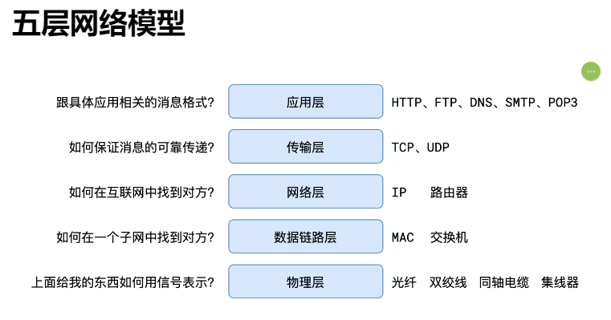
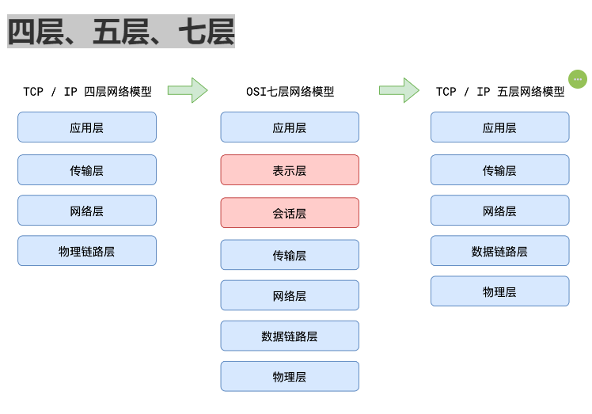

## 网络的五层模型

::: info 答案

从上到下分别为：应用层、传输层、网络层、数据链路层、物理层。在发送消息时，消息从上到下进行打包，每一层会在上一层基础上加包，而接受消息时，从下到上进行解包，最终得到原始信息。

其中：

- 应用层主要面向互联网中的应用场景，比如网页、邮件、文件中心等等，它的代表协议有 http、smtp、pop3、ftp、DNS 等等

- 传输层主要面向传输过程，比如 TCP 协议是为了保证可靠的传输，而 UDP 协议则是一种无连接的广播，它们提供了不同的传输方式

- 网络层主要解决如何定位目标以及如何寻找最优路径的问题，比如 IP 等等

- 数据链路层的作用是将数据在一个子网（广播域）内有效传输，MAC 地址、交换机都是属于该层的

- 物理层是要解决二进制数据到信号之间的互转问题，集线器、双绞线、同轴电缆等都是属于盖层的设备

:::

::: details 四层、五层、七层

:::

# 面试题

1. http 常见请求方法有哪些？

> 参考答案：
>
> - GET，表示向服务器获取资源
> - POST，表示向服务器提交信息，通常用于产生新的数据，比如注册
> - PUT，表示希望修改服务器的数据，通常用于修改
> - DELETE，表示希望删除服务器的数据
> - OPTIONS，发生在跨域的预检请求中，表示客户端向服务器申请跨域提交
> - TRACE，回显服务器收到的请求，主要用于测试和诊断
> - CONNECT，用于建立连接管道，通常在代理场景中使用，网页中很少用到

2. GET 和 POST 的区别（流利说）

> 参考答案：
>
> 从 http 协议的角度来说，GET 和 POST 它们都只是请求行中的第一个单词，除了语义不同，其实没有本质的区别。
>
> 之所以在实际开发中会产生各种区别，主要是因为浏览器的默认行为造成的。
>
> 受浏览器的影响，在实际开发中，GET 和 POST 有以下区别：
>
> 1. 浏览器在发送 GET 请求时，不会附带请求体
> 2. GET 请求的传递信息量有限，适合传递少量数据；POST 请求的传递信息量是没有限制的，适合传输大量数据。
> 3. GET 请求只能传递 ASCII 数据，遇到非 ASCII 数据需要进行编码；POST 请求没有限制
> 4. 大部分 GET 请求传递的数据都附带在 path 参数中，能够通过分享地址完整的重现页面，但同时也暴露了数据，若有敏感数据传递，不应该使用 GET 请求，至少不应该放到 path 中
> 5. 刷新页面时，若当前的页面是通过 POST 请求得到的，则浏览器会提示用户是否重新提交。若是 GET 请求得到的页面则没有提示。
> 6. GET 请求的地址可以被保存为浏览器书签，POST 不可以

## cookie/sessionStorage/localStorage 的区别

| 特性          | cookie                         | sessionStorage               | localStorage           |
| ------------- | ------------------------------ | ---------------------------- | ---------------------- |
| 存储大小限制  | 最多 4KB                       | 一般 5-10 MB                 | 一般 5-10 MB           |
| 生命周期      | 可设置失效时间（持久化或会话） | 仅在当前会话，关闭页面即消失 | 长期保持，除非明确删除 |
| 数据访问      | 所有同源窗口都可以访问         | 同一窗口（或标签页）         | 所有同源窗口都可以访问 |
| 与服务器通信  | 每次 HTTP 请求时自动发送       | 不参与服务器通信             | 不参与服务器通信       |
| 作用域        | 域和路径                       | 域                           | 域                     |
| CSRF 攻击风险 | 高                             | 无                           | 无                     |
| 兼容性        | 所有浏览器                     | HTML5 支持的浏览器           | HTML5 支持的浏览器     |

虽然 cookie、sessionStorage 和 localStorage 都可以存储数据，但它们适用于不同的使用场景，具有不同的属性和安全特性。*cookie*主要用于需要服务器与客户端之间进行状态管理时，而*sessionStorage*和*localStorage*则更适用于那些需要在客户侧持久存储大量数据，或者在用户会话中存储数据的情况。

::: details 参考答案：

> cookie、sessionStorage、localStorage 都是保存本地数据的方式
>
> 其中，cookie 兼容性较好，所有浏览器均支持。浏览器针对 cookie 会有一些默认行为，比如当响应头中出现`set-cookie`字段时，浏览器会自动保存 cookie 的值；再比如，浏览器发送请求时，会附带匹配的 cookie 到请求头中。这些默认行为，使得 cookie 长期以来担任着维持登录状态的责任。与此同时，也正是因为浏览器的默认行为，给了恶意攻击者可乘之机，CSRF 攻击就是一个典型的利用 cookie 的攻击方式。虽然 cookie 不断的改进，但前端仍然需要另一种更加安全的保存数据的方式
>
> HTML5 新增了 sessionStorage 和 localStorage，前者用于保存会话级别的数据，后者用于更持久的保存数据。浏览器针对它们没有任何默认行为，这样一来，就把保存数据、读取数据的工作交给了前端开发者，这就让恶意攻击者难以针对登录状态进行攻击。
> cookie 的大小是有限制的，一般浏览器会限制同一个域下的 cookie 总量不超过 4KB，而 sessionStorage 和 localStorage 则拥有更大的空间，多数浏览器一般要求不超过 5MB~10MB
> cookie 会与 domain、path 关联，而 sessionStorage 和 localStorage 只与 domain 关联

:::

## 请阐述 JWT 的令牌格式

> 参考答案：
>
> token 分为三段，分别是 header、payload、signature
>
> 其中，header 标识签名算法和令牌类型；payload 标识主体信息，包含令牌过期时间、发布时间、发行者、主体内容等；signature 是使用特定的算法对前面两部分进行加密，得到的加密结果。
>
> token 有防篡改的特点，如果攻击者改动了前面两个部分，就会导致和第三部分对应不上，使得 token 失效。而攻击者不知道加密秘钥，因此又无法修改第三部分的值。
>
> 所以，在秘钥不被泄露的前提下，一个验证通过的 token 是值得被信任的。
