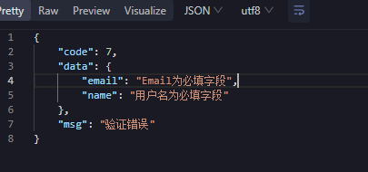

## 参数绑定

使用 binding 可以很好的完成参数的绑定

### 查询参数

```go
type User struct {
  Name string `form:"name"`
  Age  int    `form:"age"`
}
var user User
err := c.ShouldBindQuery(&user)
fmt.Println(user, err)type User struct {
  Name string `form:"name"`
  Age  int    `form:"age"`
}
var user User
err := c.ShouldBindQuery(&user)
fmt.Println(user, err)
```

### 路径参数

```go
type User struct {
  Name string `uri:"name"`
  ID   int    `uri:"id"`
}
var user User
err := c.ShouldBindUri(&user)
fmt.Println(user, err)
```

### 表单参数

```go
type User struct {
  Name string `form:"name"`
  Age  int    `form:"age"`
}
var user User
err := c.ShouldBind(&user)
fmt.Println(user, err)
```

> 注意：不能解析 x-www-form-urlencoded 的格式

### json 参数

```go
type User struct {
  Name string `json:"name"`
  Age  int    `json:"age"`
}
var user User
err := c.ShouldBindJSON(&user)
fmt.Println(user, err)
```

```go
type User struct {
  Name        string `header:"Name"`
  Age         int    `header:"Age"`
  UserAgent   string `header:"User-Agent"`
  ContentType string `header:"Content-Type"`
}
var user User
err := c.ShouldBindHeader(&user)
fmt.Println(user, err)
```

## binding 内置规则

如果有多个规则，使用逗号分隔

```go
// 不能为空，并且不能没有这个字段
required： 必填字段，如：binding:"required"

// 针对字符串的长度
min 最小长度，如：binding:"min=5"
max 最大长度，如：binding:"max=10"
len 长度，如：binding:"len=6"

// 针对数字的大小
eq 等于，如：binding:"eq=3"
ne 不等于，如：binding:"ne=12"
gt 大于，如：binding:"gt=10"
gte 大于等于，如：binding:"gte=10"
lt 小于，如：binding:"lt=10"
lte 小于等于，如：binding:"lte=10"

// 针对同级字段的
eqfield 等于其他字段的值，如：PassWord string `binding:"eqfield=Password"`
nefield 不等于其他字段的值


- 忽略字段，如：binding:"-" 或者不写

// 枚举  只能是red 或green
oneof=red green

// 字符串
contains=fengfeng  // 包含fengfeng的字符串
excludes // 不包含
startswith  // 字符串前缀
endswith  // 字符串后缀

// 数组
dive  // dive后面的验证就是针对数组中的每一个元素

// 网络验证
ip
ipv4
ipv6
uri
url
// uri 在于I(Identifier)是统一资源标示符，可以唯一标识一个资源。
// url 在于Locater，是统一资源定位符，提供找到该资源的确切路径

// 日期验证  1月2号下午3点4分5秒在2006年
datetime=2006-01-02
```

## 自己编写 binding 规则

### 错误信息显示中文

```go
package main

import (
  "fmt"
  "github.com/gin-gonic/gin"
  "github.com/gin-gonic/gin/binding"
  "github.com/go-playground/locales/zh"
  "github.com/go-playground/universal-translator"
  "github.com/go-playground/validator/v10"
  zh_translations "github.com/go-playground/validator/v10/translations/zh"
  "net/http"
  "strings"
)

var trans ut.Translator

func init() {
  // 创建翻译器
  uni := ut.New(zh.New())
  trans, _ = uni.GetTranslator("zh")

  // 注册翻译器
  v, ok := binding.Validator.Engine().(*validator.Validate)
  if ok {
    _ = zh_translations.RegisterDefaultTranslations(v, trans)
  }
}

func ValidateErr(err error) string {
  errs, ok := err.(validator.ValidationErrors)
  if !ok {
    return err.Error()
  }
  var list []string
  for _, e := range errs {
    list = append(list, e.Translate(trans))
  }
  return strings.Join(list, ";")
}

type User struct {
  Name  string `json:"name" binding:"required"`
  Email string `json:"email" binding:"required,email"`
}

func main() {
  r := gin.Default()
  // 注册路由
  r.POST("/user", func(c *gin.Context) {
    var user User
    if err := c.ShouldBindJSON(&user); err != nil {
      // 参数验证失败
      c.String(200, ValidateErr(err))
      return
    }

    // 参数验证成功
    c.JSON(http.StatusOK, gin.H{
      "message": fmt.Sprintf("Hello, %s! Your email is %s.", user.Name, user.Email),
    })
  })

  // 启动HTTP服务器
  r.Run()
}
```

### 字段名也显示中文

```go
func init() {
  // 创建翻译器
  uni := ut.New(zh.New())
  trans, _ = uni.GetTranslator("zh")

  // 注册翻译器
  v, ok := binding.Validator.Engine().(*validator.Validate)
  if ok {
    _ = zh_translations.RegisterDefaultTranslations(v, trans)
  }

  v.RegisterTagNameFunc(func(field reflect.StructField) string {
    label := field.Tag.Get("label")
    if label == "" {
      return field.Name
    }
    return label
  })
}
```

### 错误信息和错误字段一起返回



```go
package main

import (
  "fmt"
  "github.com/gin-gonic/gin"
  "github.com/gin-gonic/gin/binding"
  "github.com/go-playground/locales/zh"
  "github.com/go-playground/universal-translator"
  "github.com/go-playground/validator/v10"
  zh_translations "github.com/go-playground/validator/v10/translations/zh"
  "net/http"
  "reflect"
  "strings"
)

var trans ut.Translator

func init() {
  // 创建翻译器
  uni := ut.New(zh.New())
  trans, _ = uni.GetTranslator("zh")

  // 注册翻译器
  v, ok := binding.Validator.Engine().(*validator.Validate)
  if ok {
    _ = zh_translations.RegisterDefaultTranslations(v, trans)
  }

  v.RegisterTagNameFunc(func(field reflect.StructField) string {
    label := field.Tag.Get("label")
    if label == "" {
      label = field.Name
    }
    name := field.Tag.Get("json")
    return fmt.Sprintf("%s---%s", name, label)
  })
}

/*
{
  "name": "name参数必填",
}
*/

func ValidateErr(err error) any {
  errs, ok := err.(validator.ValidationErrors)
  if !ok {
    return err.Error()
  }
  var m = map[string]any{}
  for _, e := range errs {
    msg := e.Translate(trans)
    _list := strings.Split(msg, "---")
    m[_list[0]] = _list[1]
  }
  return m
}

type User struct {
  Name  string `json:"name" binding:"required" label:"用户名"`
  Email string `json:"email" binding:"required,email"`
}

func main() {
  r := gin.Default()
  // 注册路由
  r.POST("/user", func(c *gin.Context) {
    var user User
    if err := c.ShouldBindJSON(&user); err != nil {
      // 参数验证失败
      c.JSON(200, map[string]any{
        "code": 7,
        "msg":  "验证错误",
        "data": ValidateErr(err),
      })
      return
    }

    // 参数验证成功
    c.JSON(http.StatusOK, gin.H{
      "message": fmt.Sprintf("Hello, %s! Your email is %s.", user.Name, user.Email),
    })
  })

  // 启动HTTP服务器
  r.Run()
}
```

### 自定义校验

```go
package main

import (
  "fmt"
  "github.com/gin-gonic/gin"
  "github.com/gin-gonic/gin/binding"
  "github.com/go-playground/locales/zh"
  "github.com/go-playground/universal-translator"
  "github.com/go-playground/validator/v10"
  zh_translations "github.com/go-playground/validator/v10/translations/zh"
  "net"
  "net/http"
  "reflect"
  "strings"
)

var trans ut.Translator

func init() {
  // 创建翻译器
  uni := ut.New(zh.New())
  trans, _ = uni.GetTranslator("zh")

  // 注册翻译器
  v, ok := binding.Validator.Engine().(*validator.Validate)
  if ok {
    _ = zh_translations.RegisterDefaultTranslations(v, trans)
  }

  v.RegisterTagNameFunc(func(field reflect.StructField) string {
    label := field.Tag.Get("label")
    if label == "" {
      label = field.Name
    }
    name := field.Tag.Get("json")
    return fmt.Sprintf("%s---%s", name, label)
  })

  v.RegisterValidation("fip", func(fl validator.FieldLevel) bool {
    fmt.Println("fl.Field(): ", fl.Field())
    fmt.Println("fl.FieldName(): ", fl.FieldName())
    fmt.Println("fl.StructFieldName(): ", fl.StructFieldName())
    fmt.Println("fl.Parent(): ", fl.Parent())
    fmt.Println("fl.Top(): ", fl.Top())
    fmt.Println("fl.Param(): ", fl.Param())

    ip, ok := fl.Field().Interface().(string)
    if ok && ip != "" {
      // 传了值就去校验是不是IP地址
      ipObj := net.ParseIP(ip)
      return ipObj != nil
    }
    return true
  })
}

/*
{
  "name": "name参数必填",
}
*/

func ValidateErr(err error) any {
  errs, ok := err.(validator.ValidationErrors)
  if !ok {
    return err.Error()
  }
  var m = map[string]any{}
  for _, e := range errs {
    msg := e.Translate(trans)
    _list := strings.Split(msg, "---")
    if e.Tag() == "fip" {
      m[strings.Split(e.Field(), "---")[0]] = "该ip地址不符合要求"
      continue
    }
    m[_list[0]] = _list[1]
  }
  return m
}

func main() {
  r := gin.Default()
  // 注册路由
  r.POST("/user", func(c *gin.Context) {
    type User struct {
      Ip string `json:"ip" binding:"fip=1234" label:"ip地址"`
    }
    var user User
    if err := c.ShouldBindJSON(&user); err != nil {
      // 参数验证失败
      c.JSON(200, map[string]any{
        "code": 7,
        "msg":  "验证错误",
        "data": ValidateErr(err),
      })
      return
    }
    c.JSON(http.StatusOK, user)
  })

  // 启动HTTP服务器
  r.Run(":8080")
}
```
