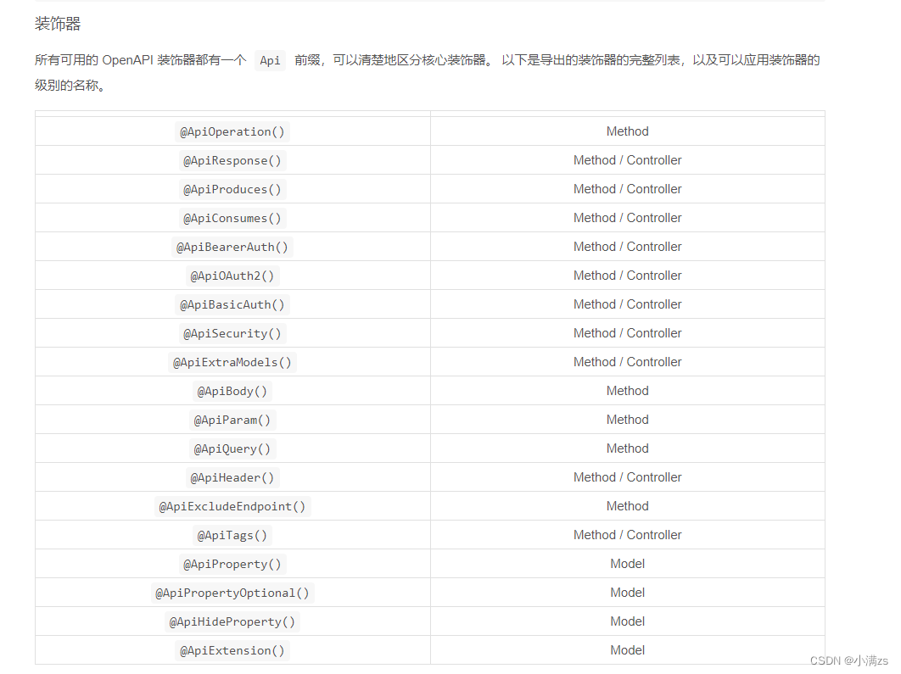

## API 文档

:::tabs

== 安装

```shell
npm install @nestjs/swagger nest-knife4j
```

== 配置

```js
import { knife4jSetup } from 'nest-knife4j'
import { SwaggerModule, DocumentBuilder } from '@nestjs/swagger'

const options = new DocumentBuilder()
  .setTitle('文档')
  .setDescription('测试')
  .setVersion('1.0')
  .addTag('测试')
  .build()
const document = SwaggerModule.createDocument(app, options)
SwaggerModule.setup('api', app, document)
knife4jSetup(app, [
  {
    name: '2.X版本',
    url: `/api-json`,
    swaggerVersion: '1.0',
    location: `/api-json`
  }
])
```

:::

::: details 常用注解

- ApiOperation：声明接口信息
- ApiResponse：声明响应信息，一个接口可以多种响应
- ApiQuery：声明 query 参数信息
- ApiParam：声明 param 参数信息
- ApiBody：声明 body 参数信息，可以省略
- ApiProperty：声明 dto、vo 的属性信息
- ApiPropertyOptional：声明 dto、vo 的属性信息，相当于 required: false 的 ApiProperty
- ApiTags：对接口进行分组
- ApiBearerAuth：通过 jwt 的方式认证，也就是 Authorization: Bearer xxx
- ApiCookieAuth：通过 cookie 的方式认证
- ApiBasicAuth：通过用户名、密码认证，在 header 添加 Authorization: Basic xxx
  

:::

### 参考资料

[使用@nestjs/swagger+nest-knife4j](https://juejin.cn/post/7400253623789666339)

## 配置文件读取

:::tabs

== 安装

```shell
# 默认支持.env
 npm i --save @nestjs/config

# 支持.yaml
 npm install js-yaml
 npm install -D @types/js-yaml
```

== 读取.env

```js

// app.module.ts
@Module({
  imports: [
    ConfigModule.forRoot({
      envFilePath: '.env',
    }),
  ],
})

// main.ts

// DATABASE_USER=myuser
// DATABASE_PASSWORD=mypassword
const configService = app.get(ConfigService);

const dbUser = configService.get('DATABASE_USER')
const dbPass = configService.get('DATABASE_PASSWORD')
```

== .yaml 使用

```js
// app.module.ts
import * as yaml from 'js-yaml';
import { readFileSync } from 'fs';

@Module({
  imports: [
    ConfigModule.forRoot({
      load: [() => yaml.load(readFileSync('config.yaml', 'utf8'))],
    }),
  ],
})

// main.ts
const configService = app.get(ConfigService);
const port = configService.get('http.port');
const host = configService.get('http.host');
const db = configService.get('db.sqlite.database');


```

== 配置文件

```yaml
http:
  host: 'localhost'
  port: 8080

db:
  sqlite:
    database: 'sqlite.db'
```

:::

## 日志集成

:::tabs

== 安装

```shell
npm install --save nest-winston winston winston-daily-rotate-file
```

== logger

```js
// utils/logger.ts
import { transports, format, createLogger } from 'winston'
export const fileLogger = createLogger({
  transports: [
    new transports.DailyRotateFile({
      dirname: 'logs',
      filename: 'error-%DATE%.log',
      datePattern: 'YYYY-MM-DD',
      zippedArchive: true,
      maxSize: '20m',
      maxFiles: '14d',
      level: 'error',
      format: format.combine(format.timestamp(), format.json())
    })
  ]
})

export const consoleLogger = createLogger({
  transports: [
    new transports.Console({
      level: 'silly',
      format: format.combine(
        format.colorize(),
        format.timestamp(),
        format.printf(({ timestamp, level, message, ...meta }) => {
          return `[${timestamp}] [${level}]: ${message} ${
            Object.keys(meta).length ? JSON.stringify(meta, null, 2) : ''
          }`
        })
      )
    })
  ]
})
```

== 日志记录配置

```js
import { Global, MiddlewareConsumer, Module, NestModule } from '@nestjs/common'
import { ConfigModule } from '@nestjs/config'
import { WinstonModule } from 'nest-winston'
import 'winston-daily-rotate-file'
import { createLogger } from 'winston'
import { LoggerMiddleware } from './common/middleware/logger.middleware'
import { fileLogger, consoleLogger } from './utils/logger'

@Global()
@Module({
  imports: [
    WinstonModule.forRoot({
      instance: createLogger({
        transports: [...fileLogger.transports, ...consoleLogger.transports]
      })
    })
  ],
  controllers: [],
  providers: [
    {
      provide: 'FILE_LOGGER',
      useValue: fileLogger
    },
    {
      provide: 'CONSOLE_LOGGER',
      useValue: consoleLogger
    }
  ],
  exports: ['FILE_LOGGER', 'CONSOLE_LOGGER']
})
export class AppModule implements NestModule {
  configure(consumer: MiddlewareConsumer) {
    consumer.apply(LoggerMiddleware).forRoutes('*')
  }
}
```

== 请求日志记录中间件

```js
// common/middleware/logger.middleware.ts
import { Inject, Injectable, NestMiddleware } from '@nestjs/common';
import { NextFunction, Request, Response } from 'express';
import { Logger } from 'winston';
@Injectable()
export class LoggerMiddleware implements NestMiddleware {
  constructor(
    @Inject('FILE_LOGGER') private readonly fileLogger: Logger,
    @Inject('CONSOLE_LOGGER') private readonly consoleLogger: Logger,
  ) {}
  use(req: Request, res: Response, next: NextFunction) {
    const { method, originalUrl: url, body, query, params, ip } = req;
    // 使用控制台日志记录器
    this.consoleLogger.info('route', {
      req: {
        method,
        url,
        body,
        query,
        params,
        ip,
      },
    });
    // 使用文件日志记录器（只记录错误）
    this.fileLogger.error('route error', {
      req: {
        method,
        url,
        body,
        query,
        params,
        ip,
      },
    });
    next();
  }
}

```

== 中间件注册

```js
import { MiddlewareConsumer, NestModule } from '@nestjs/common'
import { LoggerMiddleware } from './common/middleware/logger.middleware'

export class AppModule implements NestModule {
  configure(consumer: MiddlewareConsumer) {
    consumer.apply(LoggerMiddleware).forRoutes('*')
  }
}
```

:::
