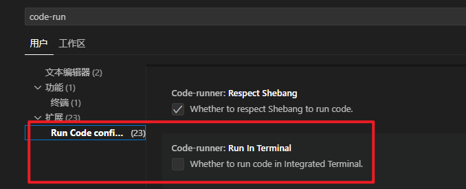
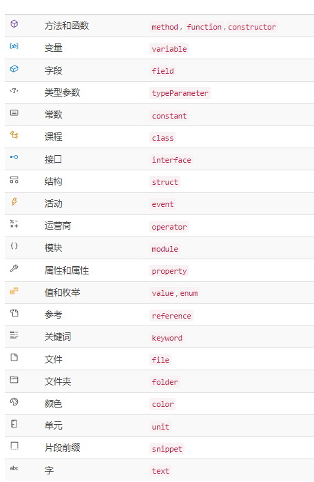

## 配置 MD 图片存储位置

> 参考: https://juejin.cn/post/7244809769794289721

```json
"markdown.copyFiles.destination": {
    "/docs/api/**/*": "${documentWorkspaceFolder}/docs/images/"
}
```

## 下载慢

> 替换下载 域名为: vscode.cdn.azure.cn

## Code Runner 设置外部终端

> 打开首选项里的设置，找到扩展(Extensions)里边有个 Code-runner:Run In Termial.,就是他勾选上



## 快捷键

> mac 系统将 ctrl 换成 ⌘ 即可

| 快捷键                  |                            |
| ----------------------- | -------------------------- |
| ctrl + i                | 提示                       |
| **ctrl + x**            | 删除单行                   |
| alt + ↓                 | 将当前行移动到下一行       |
| ctrl + /                | 注释，取消注释             |
| ctrl + +                | 界面整体放大               |
| **ctrl + f**            | 查找                       |
| **鼠标中键框选**        | 随意框选内容               |
| **ctrl + d**            | 选中下一个相同内容         |
| **shift + alt + ↓**     | 复制代码到下一行           |
| **ctrl + 回车**         | 新建下一行，光标跳到下一行 |
| **ctrl + shift + 回车** | 新建上一行，光标跳到上一行 |

## Emmet 语法

> vscode 天生支持 emmet 语法,使用 emmet 语法可以快速的生成元素结构,书写完 emmet 之后，按**tab**键即可生成元素

| emmet                    | 含义                          |
| ------------------------ | ----------------------------- |
| ! 或 html:5              | 生成文档结构                  |
| 元素名                   | 生成指定元素                  |
| 元素名\*数量             | 生成指定数量的元素            |
| 元素名\[属性名="属性值"] | 生成元素，同时附带指定属性    |
| 元素名#id 值             | 生成指定 id 值的元素          |
| input:type 值            | 生成指定 type 值的 input 元素 |
| 元素名>元素名            | 生成父子结构的元素            |
| 元素名>{内容}            | 生成指定内容的元素            |
| \$                       | 占位符，在生成元素时动态增加  |
| 元素名+元素名            | 生成兄弟元素                  |

## 提示图标解释


