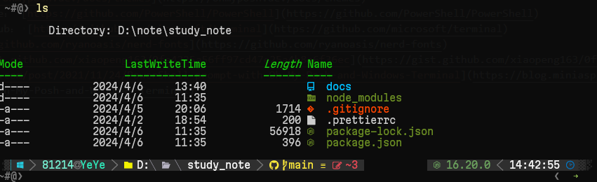

# Windows 终端美化

::: details 相关连接参考

- oh-my-posh： [https://ohmyposh.dev/docs/themes](https://ohmyposh.dev/docs/themes)
- powershell github core： [https://github.com/PowerShell/PowerShell](https://github.com/PowerShell/PowerShell)
- windows terminal github： [https://github.com/microsoft/terminal](https://github.com/microsoft/terminal)
- nerd-fonts: [https://github.com/ryanoasis/nerd-fonts](https://github.com/ryanoasis/nerd-fonts)
- 安装步骤：[https://gist.github.com/xiaopeng163/0fe4225a56ff97cd47e25a4b8a6f36ec](https://gist.github.com/xiaopeng163/0fe4225a56ff97cd47e25a4b8a6f36ec)
- [https://blog.miniasp.com/post/2021/11/24/PowerShell-prompt-with-Oh-My-Posh-and-Windows-Terminal](https://blog.miniasp.com/post/2021/11/24/PowerShell-prompt-with-Oh-My-Posh-and-Windows-Terminal)

:::

## 安装

::: code-group

```shell [安装相关软件]
# 安装 powershell 7
winget install Microsoft.PowerShell

# 安装 windows terminal
winget install Microsoft.WindowsTerminal

# 安装 oh-my-posh
winget install JanDeDobbeleer.OhMyPosh

(Get-Command oh-my-posh).Source

```

```shell [PowerShell 配置]
# 设置 PowerShell 执行策略

Set-ExecutionPolicy Unrestricted -Scope CurrentUser -Force


# 安装相关模块

Install-Module posh-git -Scope CurrentUser

Install-Module -Name Terminal-Icons -Repository PSGallery -Force

Install-Module -Name PSReadLine -AllowPrerelease -Scope CurrentUser -Force -SkipPublisherCheck

code $PROFILE
```

```shell [相关配置]
oh-my-posh init pwsh --config $env:POSH_THEMES_PATH\slim.omp.json | Invoke-Expression
#------------------------------- Import Modules BEGIN -------------------------------
# 引入 posh-git
Import-Module posh-git

# Install-Module -Name git-aliases

# 引入 file-cource Terminal-Icons
Import-Module Terminal-Icons

# 引入 ps-read-line
if ($host.Name -eq 'ConsoleHost') {
    Import-Module PSReadLine
}
#------------------------------- Import Modules END   -------------------------------
#-------------------------------  Set Hot-keys BEGIN  -------------------------------
# 设置预测文本来源为历史记录
Set-PSReadLineOption -PredictionSource History

# 每次回溯输入历史，光标定位于输入内容末尾
Set-PSReadLineOption -HistorySearchCursorMovesToEnd

# 设置 Tab 为菜单补全和 Intellisense
Set-PSReadLineKeyHandler -Key "Tab" -Function MenuComplete

# 设置 Ctrl+d 为退出 PowerShell
Set-PSReadlineKeyHandler -Key "Ctrl+d" -Function ViExit

# 设置 Ctrl+z 为撤销
Set-PSReadLineKeyHandler -Key "Ctrl+z" -Function Undo

# 设置向上键为后向搜索历史记录
Set-PSReadLineKeyHandler -Key UpArrow -Function HistorySearchBackward

# 设置向下键为前向搜索历史纪录
Set-PSReadLineKeyHandler -Key DownArrow -Function HistorySearchForward
#-------------------------------  Set Hot-keys END    -------------------------------

#-------------------------------  命令别名   -------------------------------

#预览版vscode 别名
Set-Alias -Name codei -Value code-insiders

#ipconfig别名
Set-Alias -Name ip -Value ipconfig

#清除控制台内容
Clear-Host


#------------------------功能函数------------------------

function rm {
    [CmdletBinding()]
    param(
        [Parameter(Mandatory = $true, Position = 0)]
        [string[]]$Path   # 路径参数，指定要删除的文件或目录
    )

    foreach ($p in $Path) {
        if (Test-Path $p) {
            $item = Get-Item $p

            # 自动判断是否是目录，如果是，则使用递归删除
            if ($item -is [System.IO.DirectoryInfo]) {
                Remove-Item $p -Recurse -Force -Confirm:$false
            }
            else {
                Remove-Item $p -Force -Confirm:$false
            }
        }
        else {
            # 如果路径不存在，显示警告信息
            Write-Warning "无法找到路径 '$p'，因为它不存在。"
        }
    }
}

function touch {
    param(
        [Parameter(Mandatory=$true)]
        [string]$Path
    )

    $item = Get-Item $Path -ErrorAction SilentlyContinue

    if ($item -ne $null) {
        # 如果文件已存在，更新其最后写入时间
        $currentTime = Get-Date
        $item.LastWriteTime = $currentTime
    } else {
        # 如果文件不存在，创建一个新文件
        New-Item -ItemType File -Path $Path -Force
    }
}
```

:::

## 安装效果

::: details 最终效果

:::
