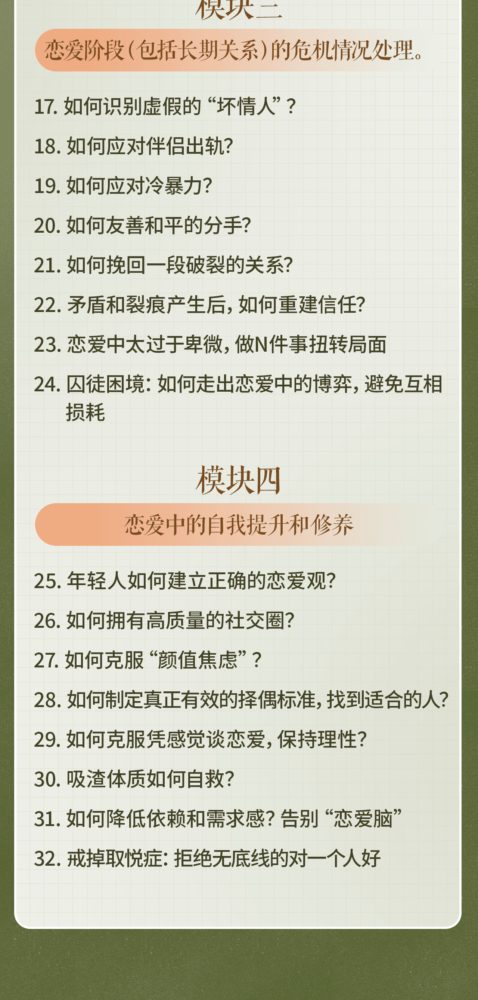
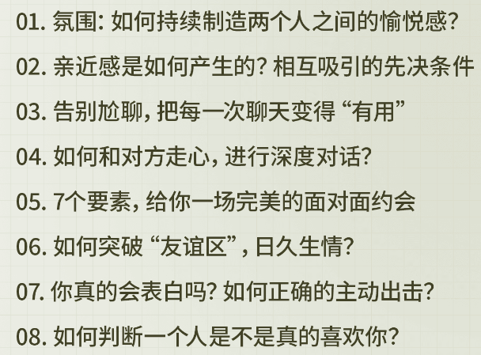
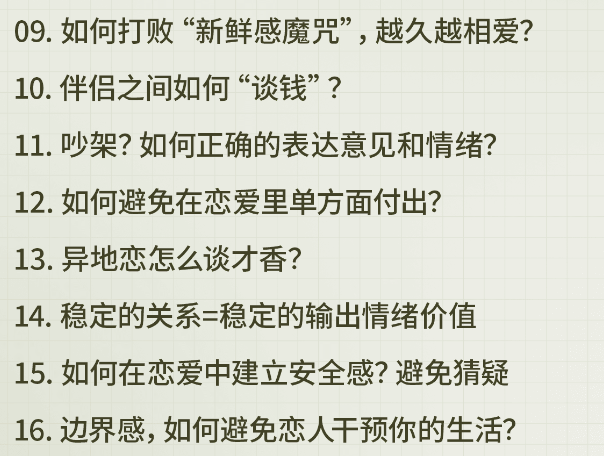
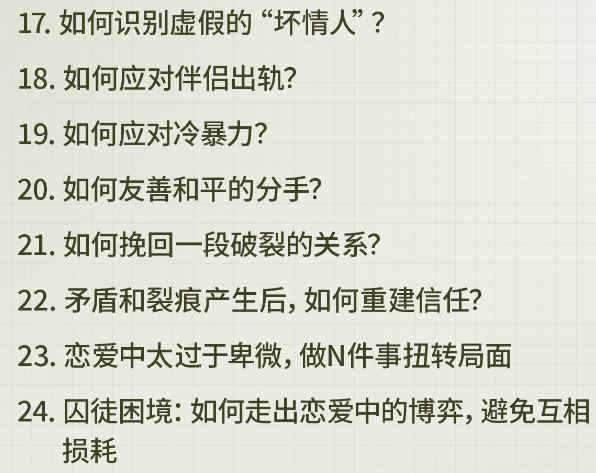
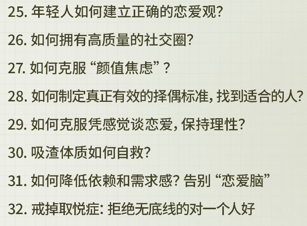

# 课程大纲

::: details 点击查看完整课程大纲

:::

## 模块一

::: details 有关“吸引力”的展示和“好感”的产生

:::

## 模块二

::: details 恋爱阶段的维护，深入，以及稳定恋爱关系

:::

## 模块三

::: details 恋爱阶段（包括长期关系）的危机情况处理

:::

## 模块四

::: details 恋爱中的自我提升和修养

:::
