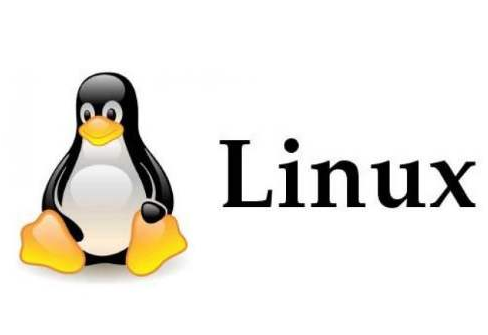
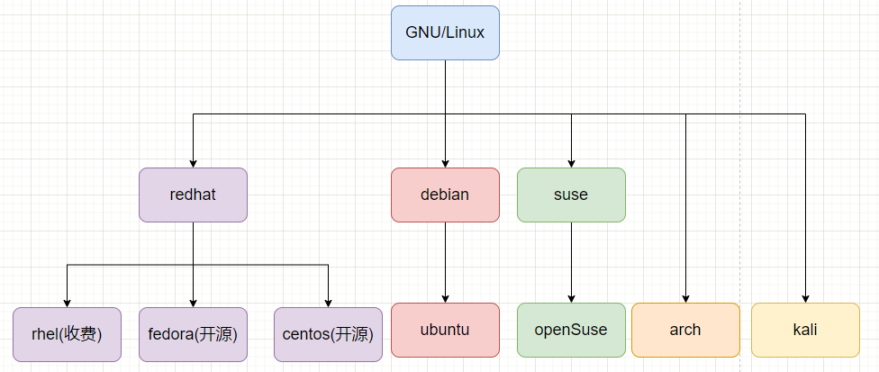
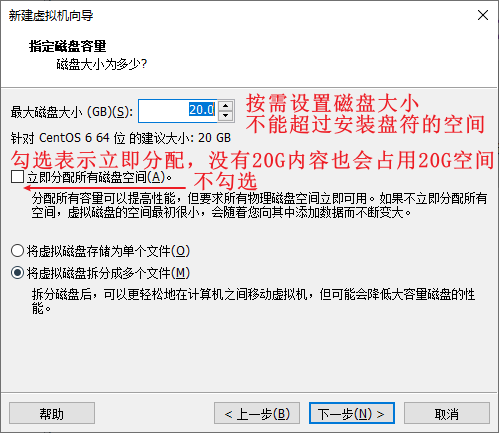
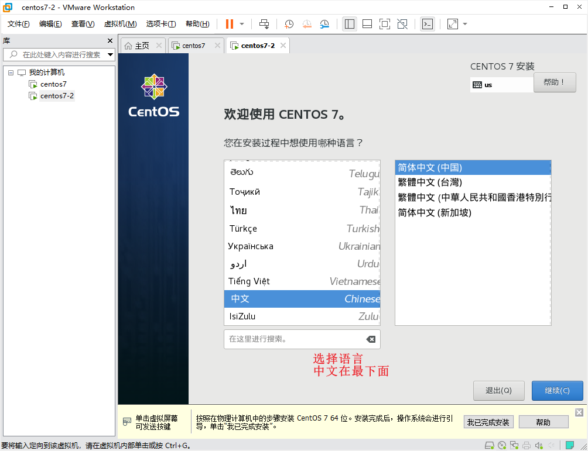
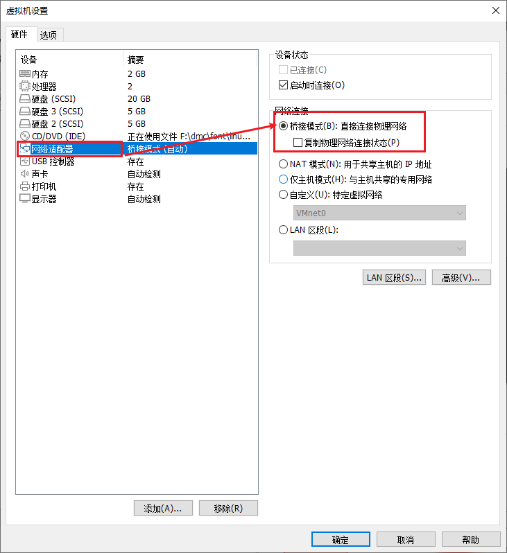
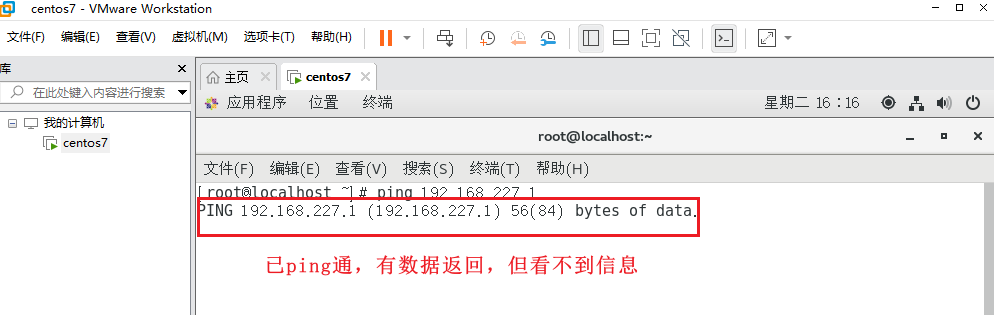

# Linux

# 一 基础篇

## 1 linux 概述

### 1）什么是 linux

> **操作系统**

- linux 是一个操作系统， 与 windows , macOS，unix ，android ， IOS ， Harmony 一样

- 操作系统是一个软件，用来管理和控制计算机硬件资源，同时为应用程序提供运行环境
- 简单来说有 2 部分组成 ： 内核（控制硬件） ， 系统程序（进程管理，用户界面等）

> **linux kernel**

- Linux 内核 不能独立使用，需要配合系统程序才能形成一个完整可用的操作系统。

- linux 的创始人 林纳斯-托瓦兹 （linus-torvalds） 称为 linux 之父

- 1991 年发布了 linux 最早版本

- 而这个 linux 是 linux 内核。



> **GNU/Linux**

- GNU 是一个自由软件运动 ， 计划完成一个开源的操作系统 （GNU=GNU is not Unix）
- 创始人：理查德-斯托曼
- GNU 项目创建了一系列的开源工具，用来构建一个完整的操作系统， 但当时缺少内核
- 后来加入了 linux 内核， GNU 完整了。

> **linux 发行版**

- 我们使用的具体的 linux 就称为 linux 发行版， 如：centos ， ubuntu ， redhad 等
- 许多的企业或社区为了满足不同的用户和应用场景，在 gnu/linux 基础上，额外增加了许多功能， 工具以及商业和社区维护，从而形成了具有自己设计理念的 linux 系统， 就是不同的 linux 发行版




- RHEL redhat enterprise linux 红帽的企业级 linux ， 收费。

- fedora 提供了最新的开源软件和桌面环境， 由 redhat 公司支持。

- centos community enterprise operating system 社区企业级操作系统， RHEL 克隆，免费开源，稳定，版本滞后。

- debian 最遵循 gnu 规范的 linux 系统，社区类 linux 系统的典范。 包含 unstable，stable，testing 发行版。

  unstable 适合桌面用户新但不稳定，stable 稳定，适合服务器，testing 测试版。

- ubuntu linux 桌面系统，基于 debian 的 unstable 版本加强而来，不够稳定，硬件兼容性有不足。

- suse 有精美的用户操作界面，提供了大量的管理工具，适合企业级应用，服务器性能较差。

### 2）linux 操作系统的基本组成


**硬件**

- cpu ， 硬盘， 内存， 主板， 显卡，网卡 等

**内核**

- Linux 内核，操控硬件

**应用程序**

- 系统程序 systemctl(服务管理) ， ps(进程管理) ，ip(网络管理)，awk(文本处理) ， bash(命令行解释器) 等
- 用户程序 node ， mysql ， nginx ， tomcat ， qq 等

**shell 程序**

- 是一个用户操作界面 ， 可以供用户输入命令，并对命令进行解释，调用对应的程序执行操作

  systemctl start firewalld 启动防火墙

- shell 本身也是一个程序，属于系统程序，系统启动时自动启动，如果是桌面系统， 启动终端就相当于启动了一个 shell 程序

- shell 程序有很多种， 默认使用的 bash （bourne-again-shell） 还有 zsh ， fish

  shell 继承自 unix，在 unix 中叫 bourne shell（sh） ， 后来对其进行扩展，出现了 bash。

**shell 多种理解**

- shell 命令，输入的文本命令， 可能就是程序名称 ps ， ip ， ipconfig 等
- shell 程序， 默认是 bash ， 命令的解释器
- shell 脚本，是一个以.sh 结尾的文件，可以编写多个 shell 命令和控制语句，用于自动化执行和批量处理任务
- shell 编程， 就是写脚本，根据逻辑需求编写脚本完成所需要的任务

### 3）linux 与 windows

| 差异特点 | Linux                                | Windows                                |
| -------- | ------------------------------------ | -------------------------------------- |
| 发行模式 | 多种发行版本（centos，ubuntu,...）   | 单个操作系统                           |
| 内核     | Linux 内核                           | WindowNT                               |
| 项目驱动 | 企业 和 社区驱动                     | 微软开发和维护                         |
| 开源性质 | 商业版和社区版本，多数免费开源       | 闭源，商业授权。                       |
| 用户操作 | 命令行 + 桌面                        | 桌面 + 命令行                          |
| 安全性   | 安全性较好，社区庞大发现问题很快修复 | 经常更新打补丁，需要安装杀毒软件       |
| 软件支持 | 大部分软件都是自由获取，选择性少     | 大量的商业软件，选择性广，很多需要购买 |

### 4）linux 与开发运维

**linux 具有稳定性，可定制性，安全性和高性能等特点，使其成为服务器操作系统的首选。**

- 可以连续运行数月而不需要重启
- 丰富的命令行工具和脚本编程环境，是管理员能够轻松的进行任务监控和故障排查
- 高效的利用硬件资源，提供卓越的性能，使得 linux 成为运行高负载应用程序和服务的理想选择
- 成本效益，免费开源，可以节省服务器部署和运维成本。

**作为开发或运维人员，了解开发运维环境，有助于提供工作效率， 团队协作能力从而更好的完整任务**

- 软件安装，配置，环境变量的配置
- 服务器管理，自动化部署
- 基于环境特点来分析查找和解决问题
- 在不同环境中确保项目运行的一致性，避免因环境差异导致出现问题
- 根据环境确定安全策略，合理分配资源，跟踪监控性能变化即使发现问题并预警
- 根据环境指定备份和恢复策略，放置发生数据丢失这种事故

**前端开发人员也需要学习了解 linux**

- 可以为我们的工作提供额外的技能优势
- 有助于部门间更好的协作， 问题诊断，自助部署测试，性能优化，提高安全意识。
- 有助于职业发展，了解多个领域可以更好的管理项目，协同各部门之间的沟通，合理分配资源，规避风险，提高领导能力。

## 2 虚拟机

Virtual Machine 简称 VM

利用虚拟化技术，模拟出一套完整的计算机，包括处理器，硬盘，内存，网卡等硬件设备

允许在一台物理主机上同时运行多个独立的操作系统

其中这些硬件设备称为虚拟化硬件，都是通过软件模拟的，最终关联的还是主机的硬件设备

虚拟化技术的目的是提高硬件的利用率，增强系统的灵活性，降低成本。提供隔离的安全的系统环境。

**如何拥有虚拟机？**

1. 开启虚拟化技术（默认开启，如果没有开启可以在 BIOS 界面开启）

   

2. 安装虚拟化软件，负责模拟创建虚拟电脑。

   - vmware workstation pro （vmware）
   - virtualbox （vbox）

### 1）VMware

官网下载：https://www.vmware.com/

默认下一步安装即可

安装后启动提示输入激活码， 尝试输入下列激活码

```text
4A4RR-813DK-M81A9-4U35H-06KND
NZ4RR-FTK5H-H81C1-Q30QH-1V2LA
JU090-6039P-08409-8J0QH-2YR7F
4Y09U-AJK97-089Z0-A3054-83KLA
4C21U-2KK9Q-M8130-4V2QH-CF810
MC60H-DWHD5-H80U9-6V85M-8280D
ZA30U-DXF84-4850Q-UMMXZ-W6K8F
AC590-2XW97-48EFZ-TZPQE-MYHEA
YF39K-DLFE5-H856Z-6NWZE-XQ2XD
AC15R-FNZ16-H8DWQ-WFPNV-M28E2
CZ1J8-A0D82-489LZ-ZMZQT-P3KX6
YA11K-6YE8H-H89ZZ-EXM59-Y6AR0
```


**创建虚拟机**

- 这里采用高级创建过程，包含典型创建的过程内容





### 2）vbox

官网下载：https://www.virtualbox.org/

默认下一步安装即可


**创建虚拟机**


 />


### 3）虚拟机应用补充

> **删除虚拟机**

- 移除 ， 将虚拟机从管理列表中（软件平台中）移除，不可见，但虚拟机所占空间和文件还在。

  ​ 可以通过打开虚拟机将其还原

   

- 删除 ， 彻底删除， 将虚拟机所占用的目录和文件全部删除掉。此时如果再需要虚拟机，就要重新创建。

  vbox 的移除和删除在一起

  

> **复制虚拟机**

- 复制： 将当前虚拟机的目录（包含内部的所有内容）再复制一份 ， 最终会产生两个目录

   /> 

- 导出：将系统导出为一个镜像文件 （ovf ， ova）

   

## 3 linux 下载与安装

### 1）centos 系统

官网下载：https://centos.org/

- centos linux 稳定版 ， 定义维护和更新，版本滞后 最高 7 版本 （推荐）
- centos stream 最新版，滚动发行和更新，不稳定，最高 9 版本


**安装 centos**

- ctrl + alt 组合键，从虚拟机窗口切换至主机窗口


**回车后不需要任何操作，等待直到出现下面的界面**




**更换选择，点击完成后，在安装信息界面稍等片刻，待其自动处理完毕**


### 2）ubuntu 系统

官网下载：https://ubuntu.com

].png]>)\*\*

[](.p)[](.p)[](.p)[](.p)[](.p)[](.p)[](.p)g].pn)].png>)


> ubuntu 也可以切换至命令行界面
>
> alt + ctrl + F3 / F4 / F5 切换至命令行
>
> alt + ctrl + F1 /F2 切换至桌面

> 切换命令行后，中文无法显示，按如下步骤解决**（建议直接在桌面系统中使用终端）**
>
> 1. sudo apt-get install zhcon 安装 zhcon 中文终端， 如有提示输入密码即可
>
> 2. sudo adduser $(whoami) video 将当前用户加入到指定组
>
> 3. reboot 重启系统
>
> 4. 重启后再次进入命令行界面
>
> 5. zhcon --utf8 进入 zhcon 界面
>
>    就可以显示中文了
>
> 6. exit 退出 zhcon 界面，回到命令行界面

## 4 根目录结构

linux 中万物皆文件，除了我们了解的文档，图片，视频，音频文件以外，在 linux 中硬件设备，进程管理也都是以文件形式存在的。

linux 文件系统中只有一个根目录（顶级目录），就是【 / 】

其中包含了一些非常重要的子目录，不同的目录存储不同作用特点的文件。

> **bin 和 sbin 目录**

存储二进制可执行命令程序

bin 存放的是所有用户都可以使用的命令程序 如 cd ls cp mv cat 等

sbin (system bin) 存放的是系统管理员可以使用的命令 ， 如 ip ， reboot ， shutdown 等


> **boot 目录**

启动目录，用来装载和系统启动相关的程序，如内核映像，引导程序等。


> **dev 目录**

device 设备目录 ， 用来存储硬件设备信息 如 cpu ， 硬盘 ， sr0 光驱 ， input 输入设备 ， random 随机数生成器

- sda 表示一块硬盘， sda1 和 sda2 是硬盘的两个分区
- 接下来如果在加入新的硬盘， 其设备名为 sdb , sdc , 使用 lsblk 查看磁盘使用列表。


> **etc 目录**

存放配置文件信息，目前存储的都是系统程序所需要的配置信息

- 用户管理文件 /etc/passwd
- 网络映射文件 /etc/hosts
- 权限管理文件 /etc/sudoers
- 网络配置文件 /etc/sysconfig/network-scripts/ifcfg-ens33

未来自定义安装的程序也建议将配置文件放在该目录中，例如后面安装的 tomcat，其配置文件会自动存放在 etc 中

> **root 和 home 目录**

用户的主目录，每一个用户都有一个自己所属的目录（家）

默认情况下， 用户之间不能访问彼此的主目录。 root 用户除外 ， 授权用户除外。

root 用户的主目录就是 root 目录

普通用户的主目录都在 home 目录中，以各自的用户名为名称的目录。 dmc ， zs ， ls 等

**注意：主目录有一个特殊的表示符号【 ~】** 使用 pwd 可以查看~表示的当前目录路径


> **lib 和 libs 目录**

存储共享库文件 ， 包括数学库， c 库， c++库

> **media 和 mnt 目录**

用来提供设备挂载的目录，比如 usb 设备，移动硬盘设备等。

这里是一个挂载规约， 不是必须遵守，也可以挂载到自定义的目录上。

> **opt 目录**

第三方软件安装位置。 可选目录，不是系统的一部分。

> **proc 目录**

process 进程管理目录。存放进程管理的文件。

linux 万物皆文件， 启动的每一个进程都是以文件的形式存在的。

目录中的文件都是虚拟的， 随着进程启动而创建，随着进程关闭而销毁。


> **sys 目录**

提供了硬件设备的管理信息 。


> **run 目录**

是一个临时目录， 存储运行时所需要保留的信息，重启后更新

systemd 系统服务 ， lock 锁 ， user 用户

如运行时用户的一些信息，在/run/user 中有一个以用户 id 命名的文件夹

- 其中 root 用户的 id=0 可以在/etc/passwd 文件中查看 ( cat /etc/passwd )


> **srv 目录**

service 存储与服务相关的内容。这也是一个推荐使用的目录。

> **tmp 目录**

临时目录。推荐用来存放临时信息的目录

> **var 目录**

用来存储程序运行时一些可变的信息 ，最常见的就是日志。

例如：安装 tomcat 后，其日志内存就存储在/var/log/tomcat 目录中

```text
yum install tomcat -y  //快速安装tomcat（后面具体讲）
find / -name tomcat    //查看tomcat存在的目录
```


> **usr 目录**

存储用户操作相关的内容。

之前的 bin，sbin ， lib 和 lib64，都是软连接（类似于 windows 中的快捷方式），最终指向的是 usr 中对应的目录

/usr/local 目录一般用来存放用户自定义安装的程序内容

- /usr/local/bin 存放启动程序
- /usr/local/lib 存放工具库


# 二 网络篇

- ping ip/域名 测试网络连通情况
- ip addr 显示当前虚拟机网络信息
- ipconfig windows 中查看 ip 地址

## 1 网络连接模式

虚拟机一般提供了 3 种网络模式 ， NAT 模式， 桥接模式， 仅主机模式

### 1）NAT 网络模式

Network Address Translation 网络地址转换

- 虚拟机和主机构建一个专用网络，主机 NAT 服务相当于路由器，主机相当于一个外部的网络环境 为虚拟机分配不同的 IP（任意）

- 主机所在的网络中，没有任何变化

- 虚拟机可以上网

- 虚拟机之间可以互相访问

- 虚拟机可以访问主机(外部网络)

- 但默认情况下，主机无法直接和虚拟机访问，无法确定虚拟机 ip

- 可以通过地址转换，实现主机与虚拟机访问

  ```text
  主机ip:1001  访问  虚拟机1ip:1001
  主机ip:1002  访问  虚拟机1ip:1002
  主机ip:1003  访问  虚拟机2ip:1001
  主机ip:1004  访问  虚拟机2ip:1002
  ```


> **注意：按照上面所说， 理论上主机默认应该无法与虚拟机 ping 通，但实际上发现却可以 ping 通**
>
> 原因是，vmware 虚拟机软件，为主机增加了一个新的网卡，VMnet8
>
> 这个网卡也会接入到 NAT 虚拟路由器中，从而使得主机和虚拟机在同一个网络环境中，可以互 ping


> **网路地址转换配置**

在 NAT 地址转换时要求是 主机 ip+端口组合 映射 虚拟机 ip+端口组合

- 计算机网络联通后，最终是与计算机上安装运行的程序进行交互
- 每一个程序都有一个端口， 需要通过端口来确定要交互的程序

**这里以主机访问虚拟机的 tomcat 程序为例**

1. 虚拟机安装 tomcat

   yum install -y tomcat

2. 找到 tomcat 的程序存放目录

   find / -name tomcat

   cd /usr/share/tomcat/webapps

3. 创建一个允许默认访问的项目（目录）

   mkdir ROOT

4. 在项目中创建一个网页

   cd ROOT

   vi index.html

   （进入一个编辑界面，按 i 键，可以输入 html 内容）

   （按 esc 退出编辑，输入:，再输入 wq 保存并退出）

5. 启动 tomcat 服务

   systemctl start tomcat

6. linux 浏览器访问测试

   localhost:8080

   （可以看到编写的 html 内容）

7. 主机启动 VMnet8，浏览器访问

   192.168.7.132:8008 （使用你自己的 linux ip）

8. 访问不同，可能是 linux 防火墙问题，关闭防火墙

   systemctl stop firewalld

9. 再次访问应该成功

10. 主机关闭 VMnet8，浏览器访问，访问失败，需要配置 NAT 地址转换

11. VMware 配置 NAT 地址转换，需要关闭系统，设置转换，启动程序再此时（注意要重新关闭防火墙）

    

​ 

​ 

​ 

> **vbox 虚拟机的 NAT 转换设置**


### 2）桥接模式

- 虚拟机直接连入外部网络的模式

- 虚拟机和主机在同一个网络环境中， 彼此是并列的，可以上网，可以互相访问

- vmware 虚拟机提供了一个 VMnet0 网卡，不是具体的网卡，具体是通过桥接至主机的物理网卡，最终使用的是主机的物理网卡，所以虚拟机会与主机在同一个网络环境中。


**这里需要注意，由于主机中的网卡可能比较多， 所以不能全依靠自动，要手动选择合适的桥接网卡。**





### 3）仅主机模式

Host-Only 模式

- 虚拟机和主机共享一个专用的网络环境，与外部网络环境隔绝
- 主机与虚拟机可以连通，但虚拟机不能上网。
- 此时主机需要有一块单独的网卡才能与虚拟机在一个专用的网络环境中
  - vmware 提供了 VMnet1
  - vbox 也为仅主机模式提供了一块网卡


> **注意 1：主机与虚拟机有专属的网络，互 ping 时要使用专属网络的 ip**


> **注意 2：虚拟机在 ping 主机时，表示联通但没有回显信息，需要在主机中启用回显**

防火墙设置->高级设置->入站规则->文件和打印机共享(回显请求-ICMPV4-In)->启用规则




## 2 静态 IP 配置

- **桌面系统，使用可视化工具设置静态网络 ip**

  

  ​ 

- **命令行界面，使用网络配置文件来配置静态网络 ip**

  ```text
  vi /etc/sysconfig/network-scripts/ifcfg-ens33  编辑网络配置文件
  	主要了解两个配置项：
  	BOOTPROTO 设置网络启动协议  默认dhcp自动分配ip ， static手动设置ip
  	ONBOOT 设置网络接口是否启动  yes ， no

  	如果设置BOOTPROTO=static，表示要设置静态ip，那么还需要额外增加3个配置项
  	IPADDR=192.168.7.66	  自定义ip
  	GATEWAY=192.167.7.2   网关 (192.168.7.1 被VMnet8网卡占用了)
  	DNS1=114.114.114.114  dns

  修改网路配置文件后，需要重启网络服务使其生效
  	systemctl restart network
  ```

  > 注意：centos7 中提供了两个网络管理服务 network 和 NetworkManager
  >
  > - network 是传统的网络管理工具，在命令行系统中使用
  >
  > - NetworkManager 是一个更现代的网络管理工具，桌面系统中使用，支持图形化网络设置，支持 wifi 网络，自动扫描，支持动态切换网络等
  >
  > - 如果网络重启失败，在确保设置正确的情况下，可以关闭 NetworkManager，防止网络管理冲突
  >
  >   systemctl stop NetworkManger
  >
  >   systemctl disable NetworkManager

  

## 3 远程连接

### 1）SSH 协议与 OpenSSH

SSH 协议：是 secure sh 的缩写，是一种用于安全远程登录和操作命令的网络协议

​ 通过加密通信提供了对网络计算机进行安全访问的能力

OpenSSH： 是一个开源的 SSH 协议的实现， 包含 ssh 协议的客户端和服务端组件

- sshd 服务端程序，默认的端口号是 22 ， linux 系统防火墙默认开放 22 端口
- ssh 客户端程序，使用客户端去连接另一个主机的 sshd 服务端

### 2）ssh 远程连接工具

基于 ssh 协议的远程连接工具有很多，常用的有：

- openssh 自带的 ssh 工具，需要在命令行使用 相当于 ssh 命令行工具
- xshell
- finallshell
- secureCRT

> **ssh 命令行工具的使用**

```text
ssh username@linuxip   #按提示输入 yes ， 输入密码
ssh root@192.168.7.66
```


> **xshell 工具**

官网下载：xshell.com

官网提供了永久免费的家庭学校用户版，需要先安装正常软件，再安装免费激活程序。 （似乎直接安装激活程序也可以）

**工具使用**


**第一次连接会生成秘钥，接受保存即可**

> **finallshell 工具**

官网下载：hostbuf.com

安装时会提示缺少内容，并允许自动下载安装， 我们按提示安装即可。

**工具使用**


**第一次连接会生成秘钥，接受保存即可**

## 4 文件传输

文件传输是建立在远程连接的基础上。

我们可以使用命令的方式和工具的方式实现文件传输。

> **SCP 命令文件**

```text
windows命令行：
scp f:/z/redis.tar.gz root@192.168.7.66:/root/桌面/a/redis.tar.gz  传输单个文件
scp -r f:/z root@192.168.7.66:/root/桌面/ 						 传输目录
```

> **finallshell 传输文件**

软件自带传输文件的功能


> **xftp 传输文件**

xshell 的一个文件传输工具，可以单独使用也可以基于 xshell 使用

- 单独使用需要输入连接信息
- 基于 xshell 使用户自动连接当前 xshell 连接的主机


> **winSCP 传输文件**

官网下载：winscp.net


## 5 连接访问控制

### 1）hosts.allow 和 hosts.deny

这是 tcpd 服务的两个配置文件

tcpd 服务又称为 TCP Wrapper，是一个用于网络访问控制的服务

该服务会通过上面的两个配置文件，控制外部 ip 对本机服务的远程访问

- 执行时会先检查 deny 再检查 allow
- 可以控制的服务有 sshd ， httpd ， telnet ， ftp 等

```text
/etc/hosts.allow  这里配置允许的访问ip
/etc/hosts.deny   这里配置不允许访问的ip

sshd:192.168.7.1
sshd:192.168.7.* or sshd:192.168.7.  表示一个ip段
sshd:ALL
ALL:ALL
```

### 2）firewalld 和 firewall-cmd

firewalld 防火墙服务，可以控制外部 ip 对本机服务和程序(端口)的访问

- 默认开放一些服务 如 ssh(22)

- 如 8080 端口默认就是不开放的，所以外部无法访问

  ```text
  systemctl status firewalld  查看防火墙状态
  systemctl stop firewalld  关闭防火墙
  systemctl start firewalld  开启防火墙
  ```

firewall-cmd 防火墙服务提供的一个命令行工具，可以向防火墙提供我们的需求与设置

- 通过防火墙控制服务，端口，网络接口等

  ```text
  firewall-cmd --add-port=8080/tcp  增加一个开放的端口，默认所有的ip都可以访问该端口
  firewall-cmd --remove-port=8080/tcp 移除一个开放的端口
  firewall-cmd --list-ports 查看开放的端口列表

  firewall-cmd --add-service=ssh 增加一个开放的服务，这里ssh默认开放
  firewall-cmd --remove-service=ssh
  firewall-cmd --list-services

  firewall-cmd --list-all

  自定义规则限制
  1. 开放8080端口，但拒绝指定的ip访问
  firewall-cmd --add-rich-rule='rule family="ipv4" source address="192.168.7.1" reject'
  2. 开放了很多端口，但拒绝指定ip访问指定端口
  firewall-cmd --add-rich-rule='rule family="ipv4" source address="192.168.7.1" port port="8080" protocol="tcp" reject'
  3. 允许指定ip访问指定端口
  firewall-cmd --add-rich-rule='rule family="ipv4" source address="192.168.7.1" port port="8080" protocol="tcp" accept'


  持久化
  上述设置的防火墙相信都是临时的，重启防火墙或者重启电脑，配置就会失效
  firewall-cmd --reload 重新加载防火墙
  在命令中增加--permanent 实现持久化。 但此时不会立刻生效，需要reload重启方能生效
  firewall-cmd --add-port=8080/tcp --permanent
  firewall-cmd --reload

  ```

> **扩展：防火墙区域概念（分区管理）**

```text
防火墙自带一些分区
firewall-cmd --get-zones 查看所有分区
block dmz drop external home internal public trusted work

其中public是默认分区，我们在上面的防火墙设置中，默认都是针对于public分区设置的
其中trusted分区表示完全信任，可以使用--add-source增加源地址，为指定ip放行
firewall-cmd --add-source=192.168.7.1 --zone=trusted

如何更换分区
firewall-cmd --list-all --zone=internal  查看指定分区的防火墙配置
firewall-cmd --add-port=8080/tcp --zone=internal  为指定分区增加防火墙设置

创建删除分区
firewall-cmd --new-zone=myZone --permanent
firewall-cmd --delete-zone=myZone --permanent

```


# 三 命令篇

## 1 帮助命令

帮助我们更好的学习了解其他的命令。

> **内部命令和外部命令**

内部命令： shell 自带的一些命令，随着 shell 启动，常驻内存，执行效率较高 cd ， pwd

外部命令：shell 以外的，可以独立执行的程序命令，需要调用外部程序才能执行 ls ， mv

> **查看命令类型**

- **type 命令**

```text
type 命令名称     #查看命令类型
				 #内部命令一般会有明显的内嵌说明
				 #外部命令一般会体现xx的别名，或直接体现程序路径
案例
	type cd 	 #查看cd命令类型
	type -a cd	 #查看命令类型的同时显示命令程序所在路径
```


- **compgen 命令**

```text
案例：
	compgen -b    #查看所有的内部命令
```


> **帮助命令的使用**

```text
help 内部命令	#查看内部命令的使用信息
案例：
	help cd	   #查看cd命令的帮助信息
```


```text
外部命令 --help	#查看外部命令的使用信息
案例：
	ls --help  #查看ls命令的帮助信息
```


> **扩展：man 命令**

man（是 manual 缩写）表示使用手册，大多数的 linux 提供了 shell 命令手册

使用 man 命令查看手册，学习了解命令的更多信息

```text
案例：
    man cd     #查看命令的帮助手册
    man -f cd  #查看与指定命令有关的手册页
        [root@localhost /]# man -f cd
        cd (1)               - GNU Bourne-Again SHell (GNU 命令解释程序 “Bourne二世”)
        cd (3tcl)            - 改变工作目录
        cd (1p)              - change the working directory
    man 页码 cd  #查看命令指定页码中的信息
        man 1p cd #查看1p页中的cd信息
```

## 2 关机重启命令

> **halt 命令**

关闭系统，不断电，主板保持通电。

```text
案例：
	halt
```

> **poweroff 命令**

先关闭系统，再关闭电源

```text
案例：
	poweroff
```

> **reboot 命令**

重启系统

```text
案例：
	reboot
```

> **shudown 命令**

可以实现系统的定时关闭和重启，同时为其他用户提供广播信息

```text
shutdown [option] [time] [info]
```

```text
案例1：
	shutdown 	   #默认1分钟后关机 ， 可以使用 shutdown -c 或 ctrl+c 取消定时操作
	shutdown 10    #10分钟后关机
	shutdown 15:50 #在指定时间关机
	shutdown now   #立刻关机
```

```text
案例2：
	shutdown  === shutdown -h  #这里应该是poweroff，有些系统可能是halt
	shutdown -H # halt
	shutdown -P # poweroff
	shutdown -r # reboot
	shutdown -c # 取消关闭或重启的定时任务

	shutdown -k # 不做任何关机和重启任务，但会向其他用户发送广播信息 （如：提示即将关机）
```

```text
案例3：
	# 需要开启多个用户，如：root用户和dmc用户
	# root用户操作， dmc用户观察广播信息
	shutdown 10 '10分钟后关机'
	shutdown -r 10 '10分钟后重启'
	shutdown -k 10 '10分钟后xxx'   #这只是一个提示
```

> **systemctl suspend 命令**

系统挂起

```text
案例：
	systemctl suspend

	systemctl halt
	systemctl poweroff
	systemctl reboot
```

> **上述命令都需要使用管理员权限**

```text
案例：
	sudo reboot   #使用管理员权限重启系统
				  #		在单用户登陆系统的情况下，可以随意关机，重启，部分普通用户和管理员用户
				  #		在多用户登陆系统的情况下，普通用户需要有管理员权限才可以操作，root随意
				  #		如何具有管理权限？
				  #			1 在root用户中，将普通用户加入sudoers文件
				  #			2 执行命令时，前面加上sudo
				  #			后面用户权限管理中会详细讲
```

## 3 目录文件命令

### 1）特殊目录与路径

> **特殊目录**

```text
/	表示根目录
~	表示用户目录（用户的家目录）
	root用户的用户目录 /root
	普通用户的用户目录 /home/用户名 --> /home/dmc
.	表示当前目录
..	表示上一级目录
```

> **路径**

路径用于按照目录的层级结构，逐层指定文件或文件夹的位置

每一层目录结构之间使用【/】分隔。

这里注意，在一个路径中/有两种含义， 最开头的/表示根目录 ， 中间的/表示目录之间的分隔

路径有两种表示：

- 绝对路径：从根目录开始指定文件或文件夹的位置。 这个路径位置的表达是不变的。

  ```text
  /home/dmc/a
  /usr/passwd
  ```

- 相对路径：从当前目录位置开始指定文件和文件夹的位置，这个路径位置的表达会随着当前目录的位置而改变

  ```text
  [root@localhost ~]   （/root）
  ./../home/dmc/a	---> /home/dmc/a
  ../home/dmc/a   ---> /home/dmc/a

  ./a	---> /root/a
  a	---> /root/a
  ```

### 2）目录列表命令

> **ls 命令**

展示目录列表

```text
案例1
	ls		#展示当前目录的列表  等价于 ls ./  或者  ls .
	ls bin  #展示当前目录中bin子目录的列表  等价于 ls ./bin
	ls /usr/bin  #展示指定目录的列表
```

```text
案例2：可以配合一些选项显示更多的列表信息
	ls -a 	#展示目录中的所有子内容 （包括隐藏内容，包括 . 和 .. )
	ls -l   #展示目录中子内容更多更全的信息(但不是所有信息)
	ls -i   #展示目录中每一个子内容的索引号
```

```text
案例3：选项的组合应用
	ls -a -l -i	 等价于  ls -ali
```

```text
案例4： ll === ls -l
	ll -a
	ll -i
	ll -h #使用易读的方式显示文件和目录的大小  4096 --> 4.0KB
	ll -S #按照文件大小排序（默认倒序）
	ll -r #逆序展示（按照默认展示的反顺序展示，与排序无关）
	ll -t #按装创建或修改时间排序（默认倒序）
```

```text
ll列表结构说明
					 - 硬链接个数
文件类型     权限		 d 子目录个数  所属用户    所属组      文件大小       时间       文件名称
 d(目录)	rwxr-xr-x.  	20 		  root 		root 		3380 	10月  8 09:10 	dev
 -(文件)
 l(软连接)
 c
 b
```

> **more 命令**

用于逐页查看文本内容

可以查看文件内容

也可以配合管道符使用

```text
案例：
	more /etc/passwd   #逐页查看指定的文件
	ll | more 		   #主页查看ll的目录列表内容

	# 回车显示下一行
    # 空格显示下一页
```

> **less 命令**

用于查看文本内容， 比 more 更强大 ， 可进可退可查找

可以查看文件内容

也可以配合管道符使用

```text
案例：
	less /etc/passwd  #查看指定文件的内容
	ll | less 		  #分页查看ll的列表里内容

	# 操作快捷键与man手册操作基本相同
	# 上下左右键逐行移动
	# y 上一行  === ↑
	# e 下一行  === ↓
	# b 上一页
	# f 下一页
	# g 跳转首行
	# G 跳转尾行
	# /dmc  向下找含dmc的内容
	# ?dmc  向上找含dmc的内容
	# 更多操作见 less --help

```

> **"|" 管道符**

将前一个命令产生的文本内容通过管道符交给后面的命令来处理(计算，分页展示，搜索等)

这里我们就可以将 ll 命令的列表内容通过管道符交给 more 或者 less 来分页展示

未来还可以交给 grep 来搜索，交给 wc 统计

```text
ll | more
ll | less
ll | grep ls
ll | wc
```

### 3）目录操作命令

> **cd 命令**

切换至指定的目录

```text
案例：
	[root@localhost home]
	cd dmc	 	 #切换至当前home目录中的dmc子目录中 --> /home/dmc
	cd dmc/桌面
	cd ..		 #切换至上一目录

	cd /usr/bin  #切换至指定的目录   --> /usr/bin
```

- 注意：无论我们的路径有多长， 最终命令行展示的就是当前所在目录

  

> **pwd 命令**

显示当前目录的完整路径

```text
案例：
	pwd
```


> **mkdir 命令**

创建目录

```text
案例：
	mkdir video   #在当目录创建一个名字为video的目录
	mkdir a b c   #在当前目录中创建多个子目录，名字分别为a,b,c
	mkdir a/b/c   #在当前目录的a目录中的b目录中创建一个c目录，最终只会创建一个c目录。
				  #注意，要保证a/b目录存在
	mkdir /root/video/a/b/c #基于绝对路径，在指定的目录中创建子目录

    mkdir -p a/b/c #如果路径中的父级目录不存在，会创建父级目录
```

> **rmdir 命令**

删除空目录

```text
案例：
	rmdir video  	#删除目录
	rmdir a b c  	#删除多个目录
	rmdir a/b/c 	#最终只会删除c目录

	rmdir -p a/b/c  #会连通路径中父级目录一同删除
```

> **rm 命令**

删除文件和目录

```text
案例：
	rm 1.txt    #删除文件  会询问是否删除
	rm -f 1.txt #强制删除  不会询问
	rm -r video #递归删除文件夹中的所有内容 ， 会询问
	rm -rf video #直接删除指定目录  不询问

	rm -rf /*   #从入门到跑路的命令
```

### 4）文件操作命令

> **touch 命令**

创建空文件

```text
案例：
	touch 1.txt 		#在当前目录中创建一个1.txt文件
	touch 1.txt 2.txt   #在当前目录中创建多个文件
	touch ./a/1.txt
	touch /root/video/1.txt
```

> **vi 命令**

编辑文件（创建一个有内容的文件，首次编辑）

```text
案例：
	vi 1.txt   #会进入编辑界面，编辑后保存内容。 文件存在修改文件，文件不存在就是创建文件
			   #按i或a进入编辑状态
			   #按esc退出编辑状态
			   #按:wq保存并退出
```

> **echo 命令**

实现内容输出

- 输出什么内容？ ： 自定义内容， 变量内容
- 内容输出到哪里？ ： 控制台(终端/命令行) ， 文件

这里在使用 echo 向文件输出内容时，如果是第一次且文件还不存在，就相当于创建了一个有内容的文件

```text
案例：
	echo 文本内容  #在命令行输出指定内容
	echo $PATH    #在命令行输出(环境)变量

	echo "hello" >> 1.txt  #将内容写入1.txt文件
					  # > 重定向操作符，表示将echo输出的内容重定向到指定的位置 1.txt文件
					  # 重定向操作符有2个  > 和 >>
					  # > 会覆盖文件中的内容
					  # >> 会在文件结尾追加内容
					  # 重定向符号可以与许多命令配合使用
					  # ll >> 1.txt

    echo -e "hello \n world" >> 1.txt #支持转义 这里的\n表示换行
    echo 'hello world !!!' >> 1.txt   #这里使用单引号包含才能识别叹号!

```

> **rm 命令**

删除文件和文件夹

```text
案例：
	rm 1.txt #删除文件 会询问  输入y或n
	rm -f 1.txt #直接删除
```

> **cat 命令**

查看文件内容

```text
案例：
	cat 1.txt    #查看指定的文件内容
	cat -n 1.txt #显示文件内容时提供行号
```

> **more 命令**

逐页查看(文件)内容

```text
案例：
	more 1.txt  #逐页查看文件内容

	#更多应用见目录列表命令
```

> **less 命令**

分页查看（文件）内容

```text
案例
	less 1.txt #分页查看文件内容

	#更多应用见目录列表命令
```

> **head 命令**

查看文件头几行内容 （默认 10 行）

```text
案例：
	head 1.txt      #查看1.txt文件的头10行内容
	head -n 5 1.txt #查看1.txt文件的头5行内容
```

> **tail 命令**

查看文件尾部几行内容 （默认 10 行）

```text
案例：
	tail 1.txt 	    #查看1.txt文件的后10行内容
	tail -n 5 1.txt #查看1.txt文件的后5行内容
	tail -f 1.txt   #追踪显示其他主机向文件末尾添加的内容
					#主机一观测文档变化     tail -f 1.txt
					#主机二向文档中追加内容 echo 内容 >> 1.txt
```

### 5）复制剪切命令

> **cp 命令**

复制文件和文件夹

```text
案例：
	cp 1.txt a    #将当前目录中的1.txt文件复制到当前目录的子目录a中，复制后的文件名也叫1.txt
				  #如果a目录中已经存在1.txt名称的文件，此时则会询问是否覆盖，如何禁用询问效果呢？
				  #		理论上来讲，使用-f选项就可以强制覆盖了，不询问，如同 rm -f
				  #		实际上却依然会询问，为什么呢？
				  #		原因是 cp 默认是 cp -i 别名  -i表示交互时， 需要询问
				  #		有两种处理方式
				  #			第一种：直接使用命令对应的程序 /bin/cp -f 1.txt a
				  #			第二种：使用\cp 禁用别名      \cp -f 1.txt a
	cp 1.txt a/2.txt  #复制时可以自定复制后的文件名

	cp -r a/* b   #将a目录中的内容复制到b目录中
	cp -r a b     #将a目录复制到b目录中
```

> **mv 命令**

移动（剪切）文件和文件夹

```text
案例：
	mv 1.txt a       #移动1.txt文件到a目录中
	mv 1.txt a/2.txt #移动时指定移动后的文件名称

	mv a/* c	#将a目录中的内容移动到c目录中
	mv a   c    #将a目录移动到c目录中
```

### 6）vi 编辑器命令

vi 是 linux 自带的文本编辑器，用来编辑文本内容

还有一个与 vi 类似的文本编辑器 vim 。 属于 vi 的扩展，更能更加丰富，使用与 vi 类似，但需要安装

```text
yum install vim -y

vi 1.txt
vim 1.txt
```

使用 vi/vim 编辑文件时，一般会有两种编辑状态：

- 命令状态：进入编辑页面时的默认状态，无法输入，但可以通过快捷键命令和输入命令来操作文档
  在输入状态下可以按 esc 切换至命令状态

  ```text
  快捷键命令：
  	使用上下左右键来引动光标
  	pgUp 和 pgDn 翻页
  	^ 移动光标到行首
  	$ 移动光标到行位
  	gg 光标移动到文档开头
  	G  光标移动到文档结尾
  	10G 光标移动到指定行
  	W 光标移动到下一个单词的首位
  	b 光标移动到上一个单词

  	dd 删除光标所在行
  	10dd 从当前光标所在行开始，删除10行
  	dw 删除当前光标所属单词
  	d^ 删除从行首至光标所在位置
  	d$ 删除从光标所在位置到行尾

  	yy 复制当前行
  	10yy 复制从光标所在行开始的10行内容
  	y^ 复制从行首至光标位置
  	y$ 复制从光标位置到行尾
  	yw 复制当前光标所属单词

  	p 在光标所在行的下面粘贴之前复制内容（小写p）
  	P 在光标所在行的上面粘贴之前复制内容（大写P）
  	10p 将复制的内容粘贴10次

  	u 撤销
  ```

  ```text
  输入命令： 按:或/可以进入输入命令的状态
  	:q	退出  （要求文档没有任何改动）
  	:wq 保存并退出
  	:q! 强制退出（文档编辑失效）
  	:w  保存
  	:wq! 强制保存并退出（一般修改系统文件时的操作）

  	:set nu 设置行号
  	:set nonu 取消行号
  	/hello 查找指定的字符内容   按n光标移动到下一个查找的内容 ，按N光标移动到上一个查找内容
  	:s/old/new    用新内容替换旧内容（替换当前光标所在行的第一个old值）
  	:s/old/new/g  用新内容替换旧内容（替换当前光标所在行old值）
  	:%s/old/new/g 用新内容替换旧内容（替换当前光标所在行的第一个old值）
  ```

- 输入状态：可以输入文本内容

  ```text
  在命令状态下按i , a , o 等按键切换至输入状态
  i 从光标所在位置开始输入
  a 从光标所在位置的后面开始输入
  o 从光标所在行的下面另起新的一行开始输入

  I 从光标所在行的开头输入
  A 从光标所在行的结尾输入
  O 从光标所在行的上面另起新的一行开始输入
  ```

## 4 链接命令

用来创建一个文件或目录的引用或别名，共享文件和目录

链接分两种，软链接和硬链接

- 软链接：又称为符号链接

  ​ 类似于 windows 中的快捷方式，有自己的存储区域，存放一个文件或目录的路径，实现快速访问

  ​ 删除真实的文件和目录，软链接依然存在，所以软链接可以指向空路径

  ​ ll 命令查看目录列表信息时，软链接的文件类型是 l，文件名会使用->指向引用路径

- 硬链接：只对文件生效，相当于给文件起了一个别名，与原名称共享同一个文件

  ​ 所以原文件名称也是一个文件的硬链接

  ​ 每一个文件都有一个 inode 索引号，指向存储区域。 文件名记录了这个 inode 索引号

  ​ 创建一个新的硬链接，就相当于为文件起了一个别名，也是通过 inode 找到对应的文件存储区域

  ​ 这些硬链接彼此都是等价的，只有删除所有的硬链接，文件才会被真正删除。

  ​ ll 命令查看目录列表信息时，硬链接就是一个文件表示-，但信息中心会体现文件硬链接的个数

  ​ 使用 ll -i 查看显示文件的 inode 编号，会发现同一个文件的多个硬链接对应的 inode 相同

  ​ 一般在文件备份，共享文件数据时经常使用硬链接。

> **ln 命令**

用来创建软链接和硬链接

```text
案例：
	ln -s 1.txt ln_1.txt   			# 在当前目录下创建一个软链接ln_1.txt 指向当前目录的1.txt
	ln -s /root/video/a   ln_a	    # 在当前目录下创建一个软链接ln_a，指向/root/video/a路径
	ln -s /root/video/a   /ln_a     # 在根目录下创建一个软链接ln_a,指向/root/video/a路径
									# 这里需要注意软链接指向目标文件的路径。
									# 如果在操作软链接时，无法根据其记录的路径找到目标文件，择
									# 操作失败

	cd ln_a     #切换的是软链接代表的目录
	cd -P ln_a  #切换到软链接引用的真实目录中去
	pwd -P      #在切换至软链接目录时，可以直接显示其真实目录的路径
	rm -f ln_a  #删除软链接（文件）
	rm -r ln_a/ #删除软链接关联的那个目录中的内容


	ln 1.txt 11.txt		#在当前目录中为1.txt文件起一个别名11.txt(创建一个硬链接)
```


## 5 压缩解压缩命令

> **gzip/gunzip 命令**

压缩（解压缩）文件

单一文件压缩格式，一个压缩文件中只包含一个源文件

只能对文件压缩，不能对目录压缩

压缩文件以.gz 结尾

```text
案例：
	gzip 1.txt	#将当前目录的1.txt文件做一个压缩  （生成一个1.txt.gz压缩文件）
				#默认会删除源文件
				#如果源文件较小，最终的压缩文件范围变大了，原因是压缩文件本身也有一些信息。
				#所以最好压缩大一些的文件
	gzip 1.txt 2.txt  #对多个文件做压缩，会生成多个压缩文件
    gzip -l 1.txt.gz  #查看压缩信息
    gzip -r /etc      #对指定的目录及其子目录中的文件依次压缩生成对应的gz文件。


    gunzip 1.txt.gz				#解压单一文件
    							#解压后，压缩文件被删除
    gunzip 1.txt.gz 2.txt.gz	#解压多个文件
    gunzip -r /etc				#将目录及子目录中的所有gz文件解压缩
```

> **zip/unzip 命令**

可以压缩文件和目录，同时保留源文件，生成.zip 压缩文件

压缩时会对每一个文件或目录进行压缩。

```text
案例：
	zip 1.zip 1.txt 2.txt  #将指定的多个文件压缩成一个.zip文件
						   #压缩文件名称的.zip后缀可以省略 zip 1 1.txt 2.txt
	zip -u 1.zip 3.txt 	   #向压缩文件中增加新的内容
    zip -d 1.zip 1.txt     #从压缩文件中删除内容
    zip -sf 1.zip          #查看压缩文件中的内容列表
    zip -e 1.zip 1.txt ..  #加密压缩。按提示输入密码  解压缩时会自动提示输入密码。
    zip -r dir			   #对文件夹及其内容进行一个递归压缩
    					   #没有使用-r选项， 只会对文件夹自身压缩，不会对内容压缩

    unzip 1.zip			   #解压缩指定的文件,将其中的内容解压缩到当前目录
    unzip -d ./b  1.zip    #解压缩，将内容放置在指定的目录中
```

> **tar 命令**

本质是用来实现打包和解包

也提供了压缩和解压缩功能

```text
案例：
	tar -f a.tar  # -f 指定tar文件的名字 。 指定名字后，可以压缩，解压缩，打包，解包
				  # 没有操作功能，但无论做什么操作都必须带着-f
	tar -cf a.tar 1.txt 2.txt #将1.txt和2.txt打包到a.tar中
							  #-c 表示打包
							  #-f 表示打包的文件名
	tar -tf a.tar 	#显示a.tar文件中打包的内容
    				#-t显示打包文件的内容
    tar -rf a.tar 3.txt  #向a.tar文件中增加3.txt内容
    					 #-r 向打包文件中增加新的打包内容
    					 #-u 更新打包文件中包含的内容
    tar -f --delete a.tar 1.txt #从a.tar中删除1.txt内容
    							#--delete从打包文件中删除内容
    							#在增加，修改，删除时，只对只打包的文件有效，对压缩文件无效
    tar -vcf a.tar 1.txt  #打包时显示打包的内容
    					  #-v显示操作的详细信息
    					  #包括：打包的信息，解包的信息，压缩信息，解压缩信
    tar -vxf a.tar        #解包操作
    					  #-x表示解包


    tar -czvf a.tar.gz 1.txt #打包后使用gzip做压缩
    						 #-z表示使用gzip/gunzip实现压缩和解压缩
    						 #-J表示使用xz实现压缩
    tar -xzvf a.tar.gz       #解压缩
    tar -xzvf a.tar.gz -C ./b #将压缩文件的内容解压到指定的目录中去
    file a.tar.gz   #查看文件信息，可以知道是否做了压缩操作

```

## 6 搜索查找命令

包括对文件目录的查找 和 文件内容的查找。

> **find 命令**

查找文件和目录

是在整个目录结构中遍历查找

```text
命令基本结构 ： find [路径 从哪找] [条件选项 按什么找] [操作 找到内容如何处理（默认展示列表）]

案例：
	find		#在当前目录及其子目录中查找所有文件内容  等价于  find ./
	find /etc   #在指定的目录及其子目录中查找所有内容

	find -name 1.txt   #在当前目录及其子目录中查找名字为1.txt的文件或目录
	find -name "*.txt" #找以.txt结尾的内容
    				   # "*txt*" 包含txt内容
    				   # ”txt*”  以txt开头的
    find -iname "*TXT*"# 作用与-name相同， 查找时不区分大小写
    find -type f       #按照文件类型查找  f/d/l/c/b
    find -name "*txt*" -type f  #名称中包含txt的文件

    find -user root    #按照用户查找 （创建文件或目录的用户）
    find -group root   #按照用户组查找
    find -size +2k     #找大于2k的内容 ， -2k 小于2k内容 ， M
    find -mtime -10    #按照修改时间查找，以天为单位
    				   #-10 以当前时间为基准，找10天以内创建的内容
    				   #+10 以当前时间为基准，找10天以前创建的内容
    find -mmin -10     #以分钟为单位


	find -print        #查找结果打印到命令行（默认）
	find -ls           #将查找到的内容以ll命令的效果展示
	find -fls 2.txt    #将查找的内容以ll的形式输出至指定的文件中
	find -fprint 2.txt #将查找结果输出到指定的文件中

```

> **locate 命令**

查找文件和目录

在系统的索引数据库中查找文件和目录，不需要遍历整个目录结构，查找速度更快

不是所有的 linux 都自带 locate 命令，有的系统需要安装

- 软件包的名字 ： mlocate

  `yum install -y mlocate`

mlocate 使用预生成的文件数据库，其中包含文件和目录的索引信息（路径，权限，大小，修改时间等）

这个索引数据库是定期运行的，所以存在一定的时效性问题。使用前建议执行**updatedb 命令**更新数据库

```txt
案例：
	updatedb            #更新数据库，否则刚刚创建的文件或目录可能不会出现在数据库中
	locate txt 			#查找路径名称中包含txt的内容
	locate /etc/*.txt	#查找以/etc开头，以.txt结尾的路径
	locate */*txt*/*	#查找路径中存在txt目录的路径
	locate -b txt		#查找文件名中包含txt的内容
					    #-b basename 基于名字查找， 之前都是基于路径查找
	locate -i txt       #忽略大小写查找
    locate -c txt       #只显示查找结果的数量
```

> **grep 命令**

文本搜索工具，用于在文件中搜索内容

也可以配合管道符|，对具有标准输出的文本内容进行过滤检索

```text
案例
	grep hello 1.txt       #在指定的文件中搜索含有hello内容的行 ， 最终输出的都是一行内容
	grep hello 1.txt 2.txt #在多个文件中搜索内容
	grep -n hello 1.txt    #显示行号
	grep -c hello 1.txt    #只显示匹配的行数量
	grep -i o 1.txt        #忽略大小写搜索
	grep -v i 1.txt        #逆向搜索, 出去匹配的行， 显示都是不匹配的行
	grep -n -i i 1.txt     # 多个选项组合使用 等价于 grep -ni i 1.txt
	grep -n 'o$' 1.txt     #找到以o结尾的内容所在行 ， 简单正则表达式
	grep -n '$o' 1.txt     #找到以o开头的内容所在行
	grep -E 'i|r' 1.txt    #可以支持更丰富正则表达式
	grep -oE '\w{3}' 1.txt #-o表示只显示符合表达式的内容 ， 不再是内容所在行了


	ll /etc | grep -E 'yum|xml'   #将ll的结果交给grep搜索， 找到包含yum和xml的内容所在行
	find -name "*.txt" | grep -n '[0-9]+\.txt$' -E #找到以数字.txt结尾的文件路径
```

## 7 软件下载安装命令

程序的安装大体上分为两类

- 自动安装 ： 类似于 windows 中的 setup.exe

  ​ 少量的手动信息输入，其余的都是自动完成的

  ​ 包括文件目录的创建，配置文件，服务管理，环境变量等。

  ​ 安装后可以直接使用

- 手动安装 ： 解压压缩文件（zip）

  ​ 压缩包中包含了程序绝大多数的目录和文件，解压既安装

  ​ 解压安装后需要手动对其进行一定的配置，服务管理，环境变量配置等

> **wget 命令**

根据指定的 url 从网络中下载文件

```text
案例：
	wget url  #从指定的url地址下载文件内容。
			  #可以现在windows的浏览器中找到要下载的内容，获得其url连接。
			  #也可以网络直接查找要下载内容的连接。
	wget -b url #后台下载
```

> **rpm 命令**

rpm ： 全名是 redhat package management 由 redhat 公司推出的一个软件包管理工具

​ 类似于 windows 的 setup.exe 程序。功能更强大，可以自动的安装，升级，卸载软件

rpm 文件：称为一个 rpm 软件包，也可以理解成一个软件安装包，包括二进制文件和程序代码，元数据

​ 元数据又包括软件名称，版本，依赖关系，许可证等

​ 其中依赖关系指的就是要安装当前软件，还需要依赖哪些其他的软件或工具库。

​ rpm 在安装和卸载时会检查这些依赖 （可以跳过依赖检查实现操作）

```text
案例：
	rpm -q	tomcat	#查询已安装的软件
	rpm -qa         #查询所有已安装的软件
	rpm -qi tomcat  #-qi 等价于 -q --info 查询已安装的软件的详细信息 。 可以配合a，但不推荐
	rpm -ql tomcat  #查看软件包中的包含内容

	rpm -i rpmfile  #安装软件包
	    -h			#显示进度条
	    -v			#显示安装信息
	    			#rpm -ivh xxxxx.rpm

	rpm -e tomcat   #卸载软件包

    rpm -ivh mysql-server.rpm --nodeps #跳过依赖安装、删除
```

**注意：rpm 程序安装后，会将软件包信息存入系统的一个 rpm 数据库中 。 在/var/lib/rpm 目录中。**

**注意：debian 系列的 linux 系统，软件包管理器一般是 apt， 软件包以.deb 结尾**

> **yum 命令**

全名是 yellowdog updater modified

是一个基于 rpm 软件包的高级管理工具，用于自动化软件包管理。

能够从服务器仓库下载 rpm 软件包及其依赖的其他软件包，并一次性完成安装。

```text
案例：
	yum search tomcat  #根据关键字查找软件包 （名称包含tomcat）
	yum list tomcat    #列出指定名称的软件包信息 （名称部分支持正则）
					   #yum list可以独立使用，列出仓库中所有软件包信息，但不推荐。
					   #yum list tomcat* 列出以tomcat开头的软件包信息（正则表示）
	yum info tomcat    #列出软件包的详细信息


    yum install tomcat    #安装软件包
    yum install tomcat -y #安装时所有的询问自动选择y ， 更新删除都适合。
    yum update tomcat     #升级软件包
    yum remove tomcat     #卸载软件包
    yum deplist tomcat    #查看软件包的依赖关系

```

```text
服务器仓库：
	yum下载的所有软件包都是在服务器仓库中
	yum有默认的服务器仓库，里面不一定包含我们需要的软件包
	我们可以增加新的服务器仓库
	yum在现在时，会依次从每一个仓库寻找，直到找到位置。
	每一个仓库都可以有一个对应的仓库文件 ，在/etc/yum.repos.d/目录中
更换仓库
	场景一般是原有仓库下载速度慢，更换国内的一些仓库如：网易，阿里云等
	https://developer.aliyun.com/article/834102?spm=5176.28261954.J_7341193060.20.3db92f3dse8GFm&scm=20140722.S_community@@%E6%96%87%E7%AB%A0@@834102._.ID_community@@%E6%96%87%E7%AB%A0@@834102-RL_yum%E9%95%9C%E5%83%8F-LOC_llm-OR_ser-V_3-RK_rerank-P0_3
	https://developer.aliyun.com/mirror/centos?spm=a2c6h.12873639.article-detail.9.7440765fMQ4tOG

增加仓库
	原有仓库中不包含我们需要的软件。需要增加新仓库。有2种常用的增加仓库的方式
	方式一：自己配置
		   在/etc/yum.repos.d/目录中自定义一个仓库文件，加入所需要的仓库url
		   [仓库名，任意]
		   name=自定义名称
		   baseurl=仓库url
		   enable=1
	方式二：下载一个rpm文件并运行的
		   安装后会在系统的/etc/yum.repos.d/目录中增加仓库文件
	案例：安装htop软件
    	 epel扩展库中的工具，引入epel仓库
    	 网络找epel仓库的rpm文件 （https://fedoraproject.org/wiki/EPEL/zh-cn）
    	 运行rpm文件，会在/etc/yum.repos.d/目录中多出epel.repo文件，里面提供了epel的仓库url


仓库相关的命令应用：
	yum repolist        #列出所有的仓库
	yum repoinfo epel   #列出指定仓库的详细信息
```

> **手动安装软件**

所谓手动安装软件，就是解压既安装，但有些还需要一些额外操作

- 解压后，立刻可以使用，比如 tomcat（解压后执行 tomcat/bin/start.sh 启动，tomcat 默认访问端口 8080）

- 解压后，需要一些配置和初始化 ，比如 mysql

- 解压后，需要编译再安装，比如 nodejs ， nginx ， redis。

  这种情况，解压后得到的是程序源码，需要一个编译操作，编译成可以执行的代码，执行这些代码安装

```text
#Nginx软件安装
#1. wget 下载nginx

#2. tag  解压（未安装），解压出来的是源码

#3. 进入nginx目录，执行configure文件，检测系统环境，生成一个用来引导编译的makefile文件
#	有时会提示错误， 缺少c编译器，使用yum安装c的编译器，安装后重新运行configure文件
#	yum intall gcc -y
#	./configure

#4. 执行make命令，编译程序 （会根据makefire引导来编译）
#	有时也会出现问题，提示make: *** 没有规则可以创建“default”需要的目标“build”。 停止。
#	需要安装两个软件：openssl软件系列 和 ncurses-devel
#	yum install openssl* -y
#	yum install ncurses-devel -y

#5. 执行make install 安装nginx程序
#	安装后会将nginx启动程序安装在其他位置（不是当前nginx目录）
#	find / -name nginx
#	安装后的nginx在/usr/local/nginx中。其中/usr/local/nginx/sbin/nginx是启动程序

#6. 启动测试
#	执行/usr/local/nginx/sbin/nginx程序
#	ps aux | grep nginx 通过查看进程可以判断nginx启动
#	curl localhost		通过url访问得到反馈证明nginx启动
#						nginx的端口是80，所以访问的时候可以省略80 localhost:80 等价 localhost
#						也可以在windows浏览器测试，但注意开放80端口

```

注意：rpm 和 yum 安装软件后，会将软件不同的部分安装在不同的目录中

​ 比如运行程序/usr/bin /usr/sbin ，配置文件 /etc/

​ 具体都在哪里有，可以 find 查找一下

注意：解压的方式安装的软件，理论上就在解压的目录中

​ 但解压出来的如果是源码，通过检测，编译，安装后，也会像 rpm 一样，将软件安装在其他目录

​ 如/usr/local 中

​ 具体在哪，使用 find 查找

## 8 程序服务管理命令

> **环境变量配置**

目的是可以在任意的目录来启动执行我们安装的程序

- 如果是 rpm 或 yum 安装的程序，一般都自动配置了环境变量 例如 jdk , nodejs
- 如果是解压的方式安装的程序，默认需要进入到相应的安装目录找到启动程序 例如：nginx

要想实现在任意目录启动程序，一般有两种方式

1. 将启动程序链接到 /usr/bin 或 /usr/sbin 或 /usr/local/bin 或 /usr/local/sbin 目录中

   **`ln -s /usr/local/nginx/sbin/nginx /usr/local/bin`**

2. 配置环境变量 PATH

   之所以上面那些目录中的程序可以任意使用，是因为这些目录在环境变量 PATH 中做了配置

   PATH 环境变量配置的目录，其中的程序可以在任意目录中直接使用。

   `echo $PATH  打印PATH环境变量的内容`

   这里只需要将 nginx 启动程序所在的目录路径也增加到 PATH 目录中，也可以实现上述效果。

   PATH 环境变量的配置也分两种情况

   ```text
   情况1：
   	在~/.bash_profile文件中增加环境变量PATH的配置
   	这里配置的环境变量，只对当前用户生效
   	这个文件是一个隐藏文件 ll -a 查看
   	配置后执行 source .bash_profile 命令修改生效
   情况2：
   	在/etc/profile 文件中增加环境变量PATH的配置
   	这里配置的环境变量，对所有用户生效
   	配置后执行 source profile 命令修改生效
   上面两个配置文件中增加相同的PATH配置即可
   	export PATH=$PATH:/usr/local/nginx/sbin

   ```

> **服务管理配置**

服务是一个特殊的程序，一般以守护进程的形式在系统后台持续运行。可以随着系统启动而自动启动

我们 nginx 也能实现这种效果。

systemd 是一个系统服务管理器，是 linux 的 init 系统，负责启动和管理系统中的各种服务和进程的。

我们只需要在爱 systemd 管理器中为 nginx 配合一个服务初始化文件，systemd 就会将其当成一个服务来管理

```text
服务初始化文件的位置：
/etc/systemd/system/目录  用来放置自定义的服务初始化文件。nginx的服务文件就建议放在这个目录中
/usr/lib/systemd/system/目录 一般用来放置由yum和rpm安装软件时自动提供的服务初始化文件。
/etc/init.d/目录 旧初始化系统存放初始化文件的目录。（SysVinit)
```

```text
nginx服务初始化文件
	1.在systemd管理目录中创建nginx的服务初始化文件
      vi nginx.service
	2.在文件中配置如下:
        [Unit]												#描述服务
        Description=this is nginx server

        [Service]											#服务管理配置
        Type=forking										#服务类型 forking 后台运行
        ExecStart=/usr/local/nginx/sbin/nginx				#启动命令
        ExecStop=/usr/local/nginx/sbin/nginx -s stop		#停止命令
        ExecReload=/usr/local/nginx/sbin/nginx -s reload	#重启命令

        [Install]											#暂记固定
        WantedBy=multi-user.target
	3.配置完成后，通过systemctl命令使配置生效。
```

> **systemctl 命令**

用来管理 systemd 服务的命令行工具，可以用来启动，重启，重新加载，启用和禁用服务，可以查看服务状态。

```text
案例：
	systemctl start nginx   #启动nginx服务
	systemctl stop nginx    #关闭nginx服务
	systemctl restart nginx #重启nginx服务
	systemctl enable nginx  #设置开机自启动
	systemctl disable nginx #关闭开机自启动
	systemctl status nginx  #查看nginx服务的状态
	systemctl is-active nginx #查看nginx服务是否活跃
	systemctl list-units --type=service   #查看所有启动的服务

	systemctl daemon-reload #修改nginx.service文件后使其立刻生效。否则需要重启才能生效。
```

## 9 进程管理命令

> **ps 命令**

查看进程状态

```text
案例1：（写法一）
	ps 		#查看当前用户终端运行的程序
	ps x    #列出所有进程(不仅是终端运行的程序)
	ps u    #友好的显示风格
	ps a    #查看所有用户终端运行的程序
	ps aux  #组合


列表项说明：
USER        PID %CPU %MEM    VSZ   RSS TTY      STAT START   TIME COMMAND
root       1713  0.0  1.7 332176 32144 tty1     Ssl+ 15:08   0:01 /usr/bin/X ...
root       2015  0.0  0.1 116448  2932 pts/0    Ss   15:08   0:00 -bash
root       6367  0.0  0.0 110192   852 tty2     Ss+  16:50   0:00 /sbin/agetty ...
root       6849  0.0  0.1 155432  1872 pts/0    R+   16:55   0:00 ps u

USER 	用户名
PID  	进程id
%CPU    cpu使用率
%MEM    内存使用率
COMMAND 执行程序产生当前进程的命令

VSZ		占用虚拟内存
RSS		占用物理内存
TTY		执行终端
		？   没有终端执行  自启动
		tty1 1-6图形化终端 ， 命令行终端
		pts  伪终端  （桌面开启的终端， xshell终端）
STAT    进程状态
START	启动时间
TIME    占用CPU运行时间
```

```text
案例2：（写法二）
	ps -e      #列出所有的进程
	ps -f      #列出完整的信息
	ps -u root #列出指定用户的进程
			   # ps -u root -f
	ps -l      #列出更多的信息
    ps -ef     #组合


列表项说明
UID         PID   PPID  C STIME TTY          TIME CMD
root          1      0  0 15:08 ?        00:00:02 /usr/lib/systemd/systemd ...
root          2      0  0 15:08 ?        00:00:00 [kthreadd]
root          3      2  0 15:08 ?        00:00:00 [ksoftirqd/0]


PPID  父级进程ID
C     CPU占用率
...
```

> **pstree 命令**

查看进程树

```text
案例：
	pstree     #树结构展示
	pstree -p  #展示包含进程id
```

> **kill 命令**

终止进程

```text
案例：
	kill pid    #终止指定pid对应进程了。
	kill -9 pid #强制关闭正在执行的进程。
	kill -l     #查看所有的终止信号
				#kill-9 pid  等价于  kill SIGKILL pid
				#SIGTEMP 15 默认终止信号，优雅的关闭进程，允许完成当前任务及清理操作。
				#SIGKILL 9  强制终止信号
	killall pname #终止所有与关键字相关的进程
    			  #killall sshd
```

> **top 命令**

实时监控进程状态

```text
案例：
	top		   #开始实时监控 默认每3秒完成一个进程信息刷新
	top -d 5   #指定监控刷新时间，单位秒。
	top -i     #不显示空闲进程和僵尸进程。
	           #有些进程尽管是空闲状态，但在监控的时间间隔中发生过变化，所以也会被监控到
	top -p pid #监控指定的进程

```

```text
在监控界面中，可以通过一些快捷键来操作进程（终止）
案例：
	Shift+P  按CPU占比排序
	Shift+N  按照PID排序
	按u 输入用户名， 监控指定用户的进程
	按k 输入pid 终止指定进程
```

```text
监控信息说明

top - 10:06:54 up 42 min,  4 users,  load average: 0.00, 0.04, 0.08
      当前时间  启动时长     用户数量
Tasks: 278 total,   1 running, 277 sleeping,   0 stopped,   0 zombie
       任务总数      运行数量    空闲数量         停止数量      僵尸进程数量
%Cpu(s):  0.0 us,  3.0 sy,  0.0 ni, 97.0 id,  0.0 wa,  0.0 hi,  0.0 si,  0.0 st
        用户进程占比 系统进程占比      idle进程占比 等待进程占比
KiB Mem :  1865308 total,    94452 free,  1286764 used,   484092 buff/cache
物理内存
KiB Swap:  2097148 total,  2091764 free,     5384 used.   343972 avail Mem
交换内存


PID USER      PR  NI    VIRT    RES    SHR S  %CPU %MEM     TIME+ COMMAND
5085 root      20   0  162216   2296   1544 R   6.7  0.1   0:00.01 top
1 root      20   0  193692   5932   3188 S   0.0  0.3   0:02.03 systemd

PID 进程ID
USER 用户明
PR   优先级
NI   进程的nice值
VIRT 虚拟内存
RES  物理内存
SHR	 共享内存
S    进程状态
	 S(leeping) , R(unning) , T(stoped) , Z(ombie)
%CPU cpu占比
%MEM 内存占比

```

> **ss 命令**

用来查看网络统计信息的命令行工具，查看的信息包括连接状态，端口，ip 地址等。

早期 linux 版本使用的是 netstat 命令，现在已经弃用，使用 ss 代替。

（也可以再安装 netstat 工具 yum install net-tools）

```text
案例：
	ss      #默认显示所有连接状态的所有网络连接类型的信息
	ss -t   #显示tcp连接
	ss -u   #显示udp连接
	ss -n   #显示具体的端口号  :ssh == :22
	ss -p   #显示网络连接对应的进程id
	ss -l   #显示监听状态下的网络连接信息 80 8080这些进程端口都属于监听状态
			#查找时注意配合-n，先转换具体 端口号再grep查找
	ss -a   #显示所有状态的网络连接信息
```

```text
列表项说明：

Netid  State      Recv-Q Send-Q Local Address:Port                 Peer Address:Port
u_str  ESTAB      0      0       * 37226                            * 37236
u_str  ESTAB      0      0      /run/systemd/journal/stdout 36406   * 37068


Netid	网络类型
	u_str	unix套接字，用于本地通信 	 -x
	tcp							  	-t
	udp								-u
	inet							-4
	inet6						    -6
	package							-p
State	连接状态
	ESTAB 连接
	LISTEN 监听
	CLOSED 关闭
	UNCONN 未连接状态
Recv-Q	接收字节数
Send-Q	发送字节数
Local~	本地ip+端口
Peer~	另一端ip+端口
```

> **crontab 命令**

安排一个定时任务

在所有的守护进程中，有一个 crond 服务，负责执行定时任务的。

要执行定时任务，需要䧁 crond 服务是启动状态。

```text
案例1：
	crontab -e  #编辑定时任务
				#一个用户都会有一个用来定义定时任务的文件
				#每次编辑任务时都会打开这个文件
				#编辑任务时，默认就是一个vi编辑器
				#每一行是一个任务。
	crontab -l  #查看所有的任务
    crontab -r  #删除当前用户的所有任务
```

```text
编辑任务
	  定时任务的文件中，每一行是一个任务。
	  每一行由2部分组成 定时时间 执行的具体任务操作 ， 使用空格隔开
	  如果有多个操作要执行，可以使用后面的shell编程
	  这个时间由5部分组成  分钟 小时 日 月 星期

	  分钟范围： 0-59
	  小时范围： 0-23
	  日的范围： 1-31
	  月的范围： 1-12
	  星期范围： 0-7  （0和7都表示星期日）


	  每一个部分的表示
	  10	具体的数字1 1 1 1 1
	  *  	每分钟，每小时，每日，每月，每个星期
	  -  	1-5 一个时间范围  1到5分钟，每分钟执行性依次。 1-5小时，每小时执行一次。 日，月
	  */n 	每个n的时间段执行一次   */3 每隔3分钟执行一次， 每个3小时执行一次
      ,  	1,3,5,7  1分，3分，5分，7分中分别执行一次 。 1月，3月，5月，7月每个月执行一次。


 案例：
 	* * * * * echo hello >> taobao.log	#每分钟向taobal.log输出日志
 	0 0 * * * echo hello >> taobao.log  #每天00:00分输出日志
 	0 0 1 * * echo hello >> taobao.log  #每个月的1号00:00分输出日志
 	0 0 * * 1 echo hello >> taobao.log  #每个星期一的00:00分输出日志
 	0 0 * * * /usr/local/nginx/sbin/nginx -s reload  #每天00:00分重载nginx服务
```

## 10 用户权限管理命令

### 1）用户(组)管理

> **useradd 命令**

添加新用户

```text
案例：
	useradd lisi	#创建一个名字为lisi的用户，同时会在/home目录中生成一个改用户的主目录 叫lisi
	useradd -d /ls lisi  #在指定的位置创建用户的主目录(不推荐)
	useradd -g duyi lisi #创建lisi用户，同时指定其所属的组为duyi （确保组存在）
						 #如果没有指定组，默认所属与用户同名的组。  lisi用户默认属于lisi组
	useradd -G a,b lisi  #创建lisi用户，同时指定附加的小组，可以是多个
    useradd -u 10001 lisi #创建lisi用户，同时指定用户id（不推荐）
    useradd -c '用户描述' lisi #创建lisi用户，同时设置一些描述信息。
```

> passwd

设置用户密码

```text
案例
	passwd lisi    #为lisi用户设置密码。回车后进入输入密码的操作
				   #建议设置8位以上的密码
				   #少于8位，虽然会提示密码无效，但重复输入后也会生效。如：123
	passwd -d lisi #删除用户密码
    passwd -l lisi #锁定用户（密码）
    passwd -u lisi #解锁用户（密码）
```

> **id 命令**

查看指定用户信息

```text
案例：
	id lisi  #查看用户信息 包括用户id（名），组id（名称），附加组id（名称）
	id -u lisi #只查看用户id
	id -g lisi #只查看所属组
	id -G lisi #只查看附加组
	id -un lisi #显示具体的名字，不再显示id
```

```text
/etc/passwd文件中记录着所有用户的信息
包括我们创建的，可以bash登录用户
还包括一些不能登录的辅助用户，一般是在安装程序的时候自动创建的，例如tomcat

列表项说明：
lisi   :x :1002 :1002 : :/home/lisi    :/bin/bash
wangwu :x :1003 :1003 : :/ww           :/bin/bash
zhaoliu:x :1004 :1002 : :/home/zhaoliu :/bin/bash
zq     :x :1005 :1005 : :/home/zq      :/bin/bash

lisi  			 用户名
x     			 密码占位符
1002  			 用户id
1002  			 用户组id
空    		 	用户描述信息  useradd -c '用户描述信息' lisi
/home/lisi  	 用户的主目录
/bin/bash		 用户登录方式
				（nologin 用户不能用来登录）
```

> **usermod 命令**

修改用户信息

```text
案例：
	usermod -l ls lisi  #修改用户lisi的名字为ls
	usermod -d /ls lisi #修改用户lisi的主目录位置
	usermod -g aa lisi  #修改用户lisi所属的组
	usermod -G bb,cc lisi #修改用户lisi所属的附加组
	usermod -u 10001 lisi #修改用户lisi的uid
	usermod -c '用户描述' lisi #修改用户lisi的用户 描述信息
```

> **userdel 命令**

删除用户

```text
案例：
	userdel lisi    #删除lisi用户，默认保留用户的主目录
	userdel -r lisi #删除lisi用户及其主目录
```

> **su 命令**

切换用户

```text
案例：
	su lisi	  #切换李四用户
			  #root用户可以随意切换其他的普通用户
			  #普通用户之前的切换需要提供密码
			  #切换用户相当于开启了一个新的bash，与之前的bash属于嵌套关系
			  #使用exit退出当前切换用户的bash，回到上一个用户的bash
			  #root用户可以随意访问其他用户的主目录，普通用户无法访问其他用户的主目录(权限)
```

> **who 命令**

获得当前登录的用户信息

```text
案例：root 切换 dmc 切换 zs
	whoami  	#查看当前会话(bash)用户
				#打印：zs
	who am i	#查看当前登录终端用户的信息（最外层bash的用户信息），包括用户名，登录设备，时间
				#打印：root pts/0	2020-01-01 12:12
```

> **group 系列命令**

新增，编辑，删除用户组

所谓的用户组，就是将多个用户组织在一起，统一管理，分配权限。

```text
案例：
	groupadd aaa		#创建一个aaa组
	groupmod -n AAA aaa #将aaa组改名为AAA
	groupdel AAA		#删除AAA用户组
```

```text
可以在/etc/group文件中查看所有组的信息
```

### 2）权限管理

权限就是某一个用户对文件和目录的操作能力 （能不能操作，能做什么操作）

权限管理主要包括两个部分

- 文件和目录本身具有的权限：文件和目录允许用户做哪些操作。
- 用户具有的权限： 用户是否能做文件和目录允许的事。

> **文件和目录的权限属性**

在【ll 命令】查看目录内容的详细信息时，其中第一个部分的 10 个字符表示文件的类型和权限信息

- 第 1 个字符表示文件的类型
- 第 2-10 个字符表示文件的权限

```text
ll查看的信息

drwxr-xr-x. 2 root root      80 10月 16 09:24 by-id
drwxr-xr-x. 2 root root     160 10月 16 09:24 by-path
crw-rw----. 1 root input 13, 64 10月 16 09:24 event0
crw-rw----. 1 root input 13, 65 10月 16 09:24 event1
  文件类型	   权限信息
	d 		rwx r-x r-x
```

```text
文件类型：
	- 普通文件（包括压缩文件，rpm文件）
	d 目录
	l 软件连接

	b 块设备文件 存储设备 如：硬盘(sda)， 光驱(sr0)
	c 字符设备文件 传输设备 如：键盘(input/event)，鼠标(input/mouse)，打印机等
	s 套接字文件   进程之间的通信
```

```text
权限功能表示：一个文件或一个目录允许用户对他做什么操作呢？
	r 	读权限
		文件：可以查看文件内容   如：使用cat命令 查看文件
		目录：可以查看目录的内容 如：使用ls命令  查看目录
	w	写权限
		文件：可以编辑文件内容 ， （但不能对文件整体操作，这属于目录的权限） 如：使用vi命令 编辑文件
		目录：可以创建，删除子文件和子目录。
	x	执行权限
		文件：可以执行文件程序  如：cd ， ls ， cat， nginx ， node ， npm等
		目录：可以cd切换(进入)目录
```

```text
权限信息(d rwx r-x r-x)
	文件和目录的权限信息分成3个部分，每一个部分都是3个字符
	2-4  表示文件和目录所属用户的权限
		 上例：创建者可读，可写，可操作
	5-7  表示文件和目录所属用户组的权限 （创建文件用户所在小组内的其他用户的权限）
		 上例：与创建者所在相同组的用户 可读，可操作，不能写
	8-10 表示其他用户组的权限
		 上例：与创建者不在同一组的用户 可读，可操作，不能写
```

> **chmod 命令**

更改文件和目录的权限

文件授权有两种方式

- 字符授权（直观）

  ```text
  语法结构： chmod [ugoa] [+-=] [rwx] file/dir
  [ugoa] ：表示为文件属性的哪一个部分授权
  		 u 为创建者授权
  		 g 为创建者所在组授权
  		 o 为其他组授权
  		 a 为所有部分授权
  [+-=] ：	表示如何授权
  		 + 在原有权限基础上增加新的权限
  		 - 在原有权限基础上删减权限
  		 = 覆盖原有权限
  [rwx] ： 表示具体的赋予哪种权限


  案例：1.txt (--- --- r--)
  	chmod u+r 1.txt	#为1.txt的创建者增加一个r的权限    (r-- --- r--)
  	chomd o=w 1.txt #为1.txt的其他组重新赋予一个w权限   (r-- --- -w-)
  	chomd a+x 1.txt #为1.txt的所有授权部分增加一个x权限 (r-x --x -wx)
  ```

- 数字授权（简单）

  ```text
  语法结构： chmod 数字1数字2数字3 file/dir
  		  每一个数字表示为每一个部分授权
  		  数字1：为创建者授权
  		  数字2：为所属组授权
  		  数字3：为其他组授权

  不同权限的数字表示：
  	r = 4
  	w = 2
  	x = 1
  	rw = 6
  	rx = 5
  	wx = 3
  	rwx = 7

  案例：1.txt(--- --- r--)
  	chmod 754 1.txt	 #1.txt的最终权限（rwx r-x r--）
  ```

> **chown 和 chgrp 命令**

修改文件的所有者和所属组

```text
案例：
	chown zs 1.txt   #将1.txt的拥有者变成zs	（一般多在用户删除文件保留的情况下使用）
	chgrp duyi 1.txt #将1.txt的所属组变成duyi
```

> **修改 sudoers 文件**

让某一个用户拥有另一个用户或用户组的权限来操作与之对应的文件和目录

如：让某一个用户以管理员的身份操作文件和目录或者执行一些命令程序。

可以修改/etc/sudoers 文件，在这个文件中为某一个用户或组授权（授予其他用户和组的操作权限）

```text
root	ALL1=(ALL2) 	ALL3
root用户可以在任意主机上（ALL1)，当做任意用户（ALL2），操作任意的文件和目录（ALL3）
（程序本身是一个文件， 命令本身是一个程序）

dmc		ALL=(ALL)	ALL	  #dmc用户可以在任意主机上，以任意用户的身份，操作任意文件和目录
dmc		ALL=(zs)	ALL   #dmc用户可以在任意主机上，以zs用户的身份，操作其任意文件和目录
dmc		ALL=(ALL)	1.txt #dmc用户可以在任意主机上，以任意用户的身份，操作1.txt文件
						  #这里对1txt文件的操作对应的是x权限。也就是执行1.txt文件
						  #如果1.txt不是一个可执行文件，这个授权没有任何意义。
						  #如果1.txt是一个可执行文件， 操作语法  ./1.txt
						  #需要理解cat 1.txt   要求用户拥有对cat命令（程序文件）操作权
						  #					  要求用户有对1.txt文件的读取权
dmc		ALL=(ALL)	/usr/bin/cat /home/zs/1.txt
						  #dmc用户可以在任意主机上，以任意用户的身份，实现cat对1.txt读取
						  #只要任意用户可以操作cat，dmc用户就可以操作cat
						  #只要任意用户可以读取1.txt ，dmc用户就可以读取1.txt
dmc		ALL=(ALL)  /usr/bin/ls /home/zs #dmc可以使用ls查看zs主目录

dmc 	ALL=(ALL)	NOPASSWD:ALL	#dmc用户在以任意用户身份操作任意文件和目录时，不需要密码
								    #默认情况在使用赋权身份操作时，需要输入当前用户密码。

%aaa	ALL=(ALL)	ALL #aaa组中的用户，可以在任意主机，以任意用户的身份，操作任意文件和目录

```

**注意：在 sudoers 文件中默认提供了一个 wheel 组，支持管理员权限。可以将用户加入到 wheel 组中从而让用户具备管理员权限**

完成 sudoers 权限文件的配置后，授权自动生效。

授权的用户在执行相应的操作时，需要使用 sudo 前缀声明

```text
授权前：cat 1.txt  无法读取，因为没有权限
授权后：sudo cat /home/zs/1.txt

如果是指定用户身份   		dmc ALL=(zs)	/bin/ls /home/zs
在使用sudo执行时需要指定用户  sudo -u zs ls /home/zs
```

## 11 磁盘管理命令

> **磁盘管理相关的概念**

- 磁盘：用来永久性存储文件和数据的物理硬件设备。 在硬盘上可以划分多个分区。

- 分区：分区是对磁盘的逻辑划分。目的是隔离数据，优化磁盘空间管理。

- 逻辑卷：从应用层面而言， 逻辑卷与分区作用相似，都是一个逻辑存储范围

  ​ 逻辑卷可以理解成分区的高级应用。可以跨多个分区来存储内容

- 文件系统：每一个分区都需要有一个文件系统，定义了当前分区中文件和数据的管理机制

  ​ 常见的文件系统 ext4 , xfs , ntfs , iso9660

- 挂载点：本质就是目录路径，就是分区（文件系统）在操作系统的目录结构中的具体位置。

  ​ 挂载点目录中的文件会存储在对应的磁盘分区中

> **lsblk 命令**

用来列出块设备的信息，包括磁盘，分区，逻辑卷，光驱等。

设备命名：

- 每一个设备在 linux 中都是以文件的形式存在，这些文件一般都在/dev 目录中
- 磁盘命名一般是第一块磁盘名为 sda，第二块磁盘名为 sdb，依次类推
- 分区命名一般是某块磁盘的第一个分区为 sda1,第二个分区为 sda2，依次类推
- 逻辑卷命名 dm-0 , dm-1 (LVM /dev/mapper)
- 光驱命名一般为 src0,sr1

```text
案例：
	lsblk	 #树形结构列出所有的设备信息
	lsblk -d #不显示依赖设备（只显示顶层设备）
	lsblk -f #显示设备中文件系统类型和UUID（分区，逻辑卷，光驱）
	lsblk -l #不以树形结构展示列表
```

> **df 命令**

查看文件系统的磁盘空间使用信息

```text
案例：
	df		#显示所有文件系统的磁盘空间使用情况
	df dir	#查看某一个目录所属文件系统的磁盘空间使用情况
	df -h   #使用人性化的表示显示数值
	df -T	#显示文件系统类型
```

> **mount 和 umount 命令**

将文件系统挂载到指定的挂载点（目录）

挂在后，就可以通过挂载点来与对应的磁盘区域进行交互。

```text
案例：
	mount /dev/sr0	/root/video/b	#将指定设备(中的文件系统)挂载到指定的挂载点(目录)上
	mount -o loop /path/xxx.iso /root/video/b #将一个iso文件当做一个块设备挂载到挂载点上。
	umount /root/video/b			#将挂载点对应的文件系统卸载。


注意1：
	虚拟机光驱中的iso文件，在桌面中会自动挂载。
	但是在命令行系统中，默认不会挂载，需要使用mount命令挂载才能使用。

注意2：
	使用mount命令实现的挂载，在系统重启后失效。
	可以在/etc/fstab文件中配置，实现永久挂载。

	设备名或设备id		   挂载点				文件系统   挂载选项     备份频率  检查顺序
/dev/mapper/centos-root 	/                   xfs     defaults        0 		0
UUID=... 					/boot               xfs     defaults        0 		0
/dev/mapper/centos-swap 	swap                swap    defaults        0 		0
/dev/sdb2					/root/video/b		xfs		defaults		0 		0


挂载选项：	以何种方式挂载文件系统
			defaults  使用文件系统默认的选项
			rw		  以读写模式挂载
			ro		  以只读模式挂载
备份聘礼：	0 不备份， 1 备份
检查顺序：	0 不检查， >0 按数字从小到大的顺序检查 （检查文件系统结构，磁盘坏道等）
```

> **fdisk 命令**

磁盘分区管理工具，可以创建，删除，修改和查看磁盘分区信息

```text
案例：
	fdisk -l    	  #查看所有磁盘分区列表
	fdisk -l /dev/sda #指定磁盘的分区情况
	fdisk /dev/sdb    #对指定的磁盘做分区管理（创建，删除，编辑）
					  #在管理界面，输入m显示操作菜单，可以根据菜单完成后续的分区管理操作
					  #n新建一个分区
					  #		选择分区类型（p 主分区，只会4个，e 扩展分区，数量无限）
					  #		选择主分区号（可以默认，直接回车）
					  #		选择起始位置（可以默认，直接回车）
					  #		输入大小（+10M ， +1G）
					  #		w 保存即可
					  #d删除一个分区
					  #		选择分区号
					  #		w or q
					  #q不保存修改并退出 （修改不生效）
					  #w保存修改并退出（修改生效）
```

**注意：创建好的分区默认还无法使用，也就是无法挂载到挂载点，因为缺少文件系统。**

> **mkfs 命令**

创建文件系统（磁盘分区格式化）

```text
案例
	mkfs -t xfs /dev/sdb2   #为指定的分区创建文件系统（格式化）
```

**注意：如果分区本身存在文件系统，格式化后原有的数据被清除**

> **du 命令**

查看文件和目录占用磁盘空间的情况

```text
案例：
	du /root/video    #递归显示指定目录及其子目录占用磁盘空间情况。
	du -h /root/video #人性化的显示数值 K,M,G
	du --max-depth=2 /root/video #指定显示目录的层级数量
	du -c /root/video #额外增加一个总和显示。
	du -s /root/video #只显示总和
	du --exclude=*nginx* /root/video #排除包含指定内容的目录，显示其他目录的大小。
									 #最终的总和有变化
```

> **free 命令**

查看整体的内存使用情况

```text
案例：
	free -h  #人性化显示内存使用情况
	free -s 10 #实时监控内存使用情况。 按照指定的时间，每隔10秒刷新一次信息
```

# 四 shell 编程篇

## 1 概述

> **终端与 shell**

- 终端：计算机用户与操作系统交互的界面。这里我们使用的是文本界面

  ​ 用户可以在文本界面中输入命令并查看命令的输出结果

  ​ linux 系统的命令行界面，桌面系统的终端程序以及 xshell 等 sshd 工具的命令界面都属于文本终端界面

- shell：这里说的 shell 是一个命令行解释器，用来接收来自终端的用户输入

  ​ 将其解释并传递给系统内核来完成相应的任务

  ​ 同时负责将操作系统的输出结果返回给终端，以供用户查看

  ​ 每一个终端都至少包含一个 shell

  ​ 这里的 shell 是一个解释器的统称，不同的 linux 系统会有不同的 shell 实现 如：bash ， dash ， zsh 等

> **shell 多种含义**

- shell 程序：就是上面所述的 shell 命令解释器，将命令解释为对操作系统内核的请求，并实现与内核的通信。

  ​ 包括一些具体实现，bash，dash，zsh，fish 等

- shell 命令：用户在终端通过输入命令来表达自己的操作诉求 ，是用户与操作系统交互的一种手段。

  ​ 也可以使用可视化界面，点点点来与操作系统交互

- shell 脚本语言：表示 shell 是一种程序设计语言，可以在一个文件中编写多个 shell 指令以及循环判断等结构语句，来表达操作逻辑并可以自动化批量执行

- shell 脚本：一般是以.sh 结尾的文件，在该文件中使用 shell 语言来写逻辑代码。

- shell 编程：使用 shell 脚本语言编写 shell 脚本，实现逻辑需求的过程。

## 2 shell 脚本的编写与执行

> **编写脚本**

1. 创建脚本文件，建议以.sh 结尾。但不是必须，最终还是看内容。

2. 编写脚本内容 shell 命令+编程语法（变量，循环，判断等）

3. 注意：在编写脚本时，建议在脚本的第一行指定执行脚本的 shell 解释器

   `#!/bin/dash

> **执行脚本**

```text
方式一：sh hello.sh		#使用指定的sh解释器来执行脚本，这里sh是一个软链接，最终指向bash
方式二：bash hello.sh   #使用指定的bash解释器来执行脚本
方式三：source hello.sh
方式四：. hello.sh	    #相当于source语法的代替品
方式五：指定sh脚本文件的路径自动执行
	   ./hello.sh
	   /root/video/ss/hello.sh


方式一二三四 ： 都是使用一个命令（程序）执行指定的脚本	，此时脚本中#!指定的解释器无效。
方式一二：会开启一个新的子shell来执行脚本
方式三四：会使用当前终端(会话)正在使用的shell。不会开启一个新的子shell
方式五：将shell脚本当成一个可以执行的程序(命令)来使用。
	   使用脚本首行#!声明的shell解释器。 没有声明就是用系统默认的shell解释器
	   需要确保这个shell脚本文件有x权限。
	   一定要带路径   ./hello.sh
	   可以将其链接到/bin 或 /sbin目录中，这样就可以当成一个命令直接使用了。
	   当然还可以将脚本所在的目录配置到环境变量PATH中。
	   也会产生一个新的子shell
```

## 3 变量

用来临时存放信息的容器

> **变量种类**

- 系统变量 ： 登录系统时就已经存在的变量，我不需要我们在定义的，可以直接使用的。PATH,HOME,USER 等
- 自定义变量：系统变量中不存在，用接下来的知识自己创建的变量。

- 局部变量 ： 只能在当前 shell 环境中使用。 子 shell 都不能使用
- 全局变量：又称为环境变量，有两种情况
  - 会话级别的全局变量：当前 shell 及其子 shell 可用
  - 系统级别的全局变量：在所有的 shell 中都能使用。

> **查看变量**

- 查看指定的变量

```text
echo $PATH	#输出变量值
			#变量如果不存在，输出一个而空值
```

- 查看所有变量

```text
env	#查看所有的环境变量
set	#查看所有变量
```

> **定义局部变量**

```text
a=10			#定义了局部变量
				#局部变量一般建议使用小写字母，全局变量建议使用大写字母。
				#引用变量(获取变量值)时需要带$ , echo $a , b=$a
				#=号两侧不要带空格 a = 10 （错误）
a="hello world" #当值中含有空格时，需要使用引号包含（单双引号都可以）
a=1+2			#此时a变量的值就是"1+2" ,类似于js或java编程语言中的字符串连接。
a=$[1+2]		#赋值结果是3，实现算数运算，旧写法
a=$((1+2))		#赋值结果是3，实现算数运算，新写法
```

```text
局部变量只在当前的shell中可用。在子级shell中不可用。
如何产生一个子级shell
	开始一个新的shell程序 。 输入sh或bash
	切换一个新用户。		 输入su dmc
	使用exit退出当前的shell或用户界面，返回上一个shell界面
```

> **声明全局变量**

```text
export a	#将之前定一个局部变量声明为（提升为）全局变量
export a=10 #定义一个全局变量
			#可以在env中查看
			#在当前shell及其子shell中可以使用
			#在父级shell或其他终端shell中无法使用
			#在子shell中如果更改了全局变量，对父级shell没有影响
			#重启shell后变量消失
```

```text
通过配置两个配置文件，来定义系统级别的全局变量
/etc/profile		:使用export来配置全局变量，除此以外这个配置文件中还可以写一些其他脚本
/etc/environment	:用来设置全局变量，不需要使用export，直接key=value模式即可。
```

> **声明只读变量（常量）**

```text
readonly a      #将之前定义的变量a变成一个常量
readonly a=10	#定义一个常量a,并赋值5
readonly -p     #查看所有常量列表
```

> **撤销变量**

也就是删除变量

```text
unset a		#撤销（删除）a变量
			#注意：只读变量无法撤销
```

> **可传参变量**

只能在脚本中使用，在执行脚本时，从脚本外向脚本内参数变量传递参数值

```text
在脚本代码中，直接使用$1,$2,$3这样的名称按顺序代表参数变量列表
在传参时，第一个值就会赋值给$1,第二个值就会赋值给$2,依次类推。
如果参数超过10个，命名为$(10) $(11)
$0也是存在的，不过不用来接收参数，用来存储当前shell脚本的执行路径（相对或绝对）

hello.sh脚本代码
	echo hello $1 and $2

shell命令行
	sh hello.sh zs ls
```

```text
一些特殊的参数
$# 在脚本中获得此次执行脚本时传递的参数个数
$* 在脚本中获得此执行脚本时传递的所有参数，多个参数组成字符串，用空格隔开 "aaa bbb"
$@ 在脚本中获得此执行脚本时传递的所有参数，多个参数组成数组，显示时也是空格隔开 [aaa bbb]
```

```text
还有一个特殊的变量，可以在脚本外使用
$? 存储最后一个执行命令的执行状态码。
	0	正常执行
	1	没有查到结果
	2	目录不存在或参数错误等
	127 命令不存在
	130 ctrl+c终端执行操作
```

> **变量的赋值**

```text
a=10		  #基本的变量赋值
a='hello dmc' #使用引号包含带有空格的内容
a=1+2		  #1+2作为一个字符串赋值 a="1+2"
a+=1		  #表示字符串连接a=1+2+1
a=$[1+2]	  #旧的算数运算方式，结果a=3
a=$((1+2))    #新的算数运算方式，结果a=3 , 支持算数运算，比较运算，位运算
((a=1+2))	  #直接实现运算并赋值
			  #这种写法支持赋值运算符 += ,-= , *= , /= , %= , ++,--
			  #((a+=10)) 等价于 a=$(($a+10))
a=$(ls)		  #将()中命令的执行结果赋值给变量a
```

## 4 运算符

```text
算数运算符： + 	- 	* 	/ 	%
		   echo $((13%5))

比较运算符： > 	< 	>=	<=	==	!=		1表示真， 0表示假
		   echo $((5>=3))

位运算符：	&	| 	~	^	<<	>>
			10-->1010
			14-->1110
			10 & 14 == 1010 & 1110 == 1010 == 10
			10 ^ 14 == 1010 ^ 1110 == 0100 == 4
			1 << 2  == 0001 << 2 == 0100 == 4
			echo $((10&14))

赋值运算符：	+=	-=	*=	/=	%=	++	--
			((a+=10))
			((a++))
			a=$(($a+10))

逻辑运算符： && 	||
		   需要使用单独的命令语法来运用逻辑运算 test命令。不能使用上面运算的使用方法。
```

## 5 条件判断

可以对文件，数值大小，字符串进行判断检测

```text
test 条件表达式   或 	  [ 条件表达式 ]
案例：
	test $a -eq 10		#判断a变量的值和10是否相等
	[ $a -eq 10 ]		#判断a变量的值和10是否相等
						#执行表达式没有返回结果，但有执行状态，$?查看，0表示通过， 1表示未通过
```

```text
字符串检测：
	[ -z $a ] 	#判断变量a中的字符串内容是否为空
	[ -n $a ]   #判断变量a中的字符串内容是否非空

数字大小检测
	[ $a -eq 10 ] #a == 10
	[ $a -ne 10 ] #a != 10
	[ $a -gt 10 ] #a > 10
	[ $a -lt 10 ] #a < 10
	[ $a -ge 10 ] #a >= 10
	[ $a -le 10 ] #a <= 10

文件检测
	[ -e ~/1.txt ]	#判断文件或目录是否存在
	[ -f ~/1.txt ]	#判断是否是一个文件
	[ -d ~/1.txt ]	#判断是否是一个目录
	[ -r ~/1.txt ]	#判断是否可读
	[ -w ~/1.txt ]	#判断是否可写
	[ -x ~/1.txt ]	#判断是否可执行

```

```text
带有逻辑运算的条件判断。多个条件进行判断。
可以使用 && 和 || 符号，也可以使用 -a(and) 和 -o(or) . 但两者有些区别
&& 和 || 连接的是两个条件判断命令  ：	[ -e 1.txt ] && [ -f 1.txt ]
-a 和 -o 连接的是两个表达式	   	： [ -e 1.txt -a -f 1.txt ]
```

## 6 流程控制

> **if 分支流程**

```text
if [条件判断] ;then
	...
fi
----------------------- 	#在一行中编写多个命令语句时，使用分号隔开。
if []
then
	...
fi


案例：
	if [ $1 -ge 60 ];then
		echo pass
	fi
```

```text
if [条件判断];then
	...
else
	...
fi


案例：
	if [ $1 -ge 60 ];then
		echo pass
	else
    	echo no pass
	fi
```

```text
if [条件判断];then
	...
elif [条件判断];then
	...
elif [条件判断]	;then
	...
else
	...
fi


案例：
	if [ $1 -ge 80 ];then
		echo best
	elif [ $1 -ge 60 ];then
		echo good
	else
    	echo bad
	fi
```

> **case 多分支流程**

```text
case 变量 in
模式1)
	...
;;
模式2)
	...
;;
*)
	...
;;
esac


case支持的常用模式
	10)			#匹配具体数字
	dmc)		#匹配具体的字符串
	z*)			#匹配以z开头的字符串
	[0-9])		#匹配单位数
	[1-9][0-9])	#匹配双位数
	[a-zA-z]*)	#匹配以字母开头的字符串
	*)			#匹配所有内容，一般放在case流程最后，作为其他情况处理


案例：
	case $1 in
	10)
		echo 'input 10'
	;;
	dmc)
		echo 'input dmc'
	;;
	z*)
		echo 'z first'
	;;
	[1-9][0-9])
    	echo 'tow number'
    ;;
    [a-zA-z]*)
    	echo 'letter first'
    ;;
    *)
    	echo 'input others'
    ;;
    esac
```

> **for 循环流程**

```text
for((变量初始化;判断条件;变量变化));do
	...
done


案例：
	for((i=1;i<=$1;i++));do
		echo $i
	done
```

```text
for 变量名 in 循环列表 ;do
	...
done


循环列表的形式
	for name in zs ls ww zl     #字符串列表（数组）
	for num in {1..100}			#不能{100..1}
	for file in /root/*			#路径中的所有子内容
	for str in $(ls /root/)		#命令执行的结果


案例：
	for file in /root/* ;do
		echo $file
	done
```

> **while 循环结构**

```text
while [判断条件] ;do
	...
done


案例：1-n的和   n是传入的值

sum=0
num=1
while [ $num -le $1 ] ; do
	((sum+=num))			#sum = $[ $sum+$num ]
	((num++))				#num = $[ $num+1 ]
done
echo "sum=$sum"


注意：
	双引号中出现的$sum会当成变量引用来使用  echo "sum=$sum"  输出结果是：sum=5050
	单引号中出现的$sum会当成字符串使用		echo  'sum=$sum' 输出结果是：sum=$sum
```

## 7 补充：read 命令

echo 的反向操作，从命令行输入内容

```text
案例：
	read name           #从命令行输入一个内容，赋值给name变量
	read name1 name2    #从命令行输入多个内容，默认使用空格分隔 dmc zs
					    #IFS=',' 设置输入时的分隔符
					    #IFS=',' read name1 name2
					    #输入：hello world,hello dmc
	read -p '提示' name #指定输入提示
    read -t 10 name    #要求在指定时间秒内完成输入，否则输入结束。
    				   #没有设置时间，则一直处于等待输入状态

    read name < 1.txt  #从指定的文件中读取内容赋值给变量
```

## 8 函数

表示一个操作，一个行为，一种动作。

函数在使用上与脚本非常相似。两者含义不同。

- 脚本更多表达的是一个任务

- 函数表达的是任务中的一些具体的操作。

> **函数定义**

```text
[function] fname(){
	...
	[return value]
}
----------------------
fname(){
	....
}


案例：
	ph(){
		echo hello
	}
```

> **函数调用**

```text
printHello		  #如果执行命令一样，完成函数调用
printHello dmc zs #调用函数并传递参数
				  #执行与传参的语法和执行命令或脚本基本相同
				  #也可以向执行命令和脚本一样，在命令行中执行函数
				  #执行脚本后定义的函数可以使用set命令查看。
				  #可以在/etc/profile这样的配置文件中声明函数，使得在所有的shell中可用。
```

> **参数**

在函数中也如同脚本一样， 使用$1,$2 这种写法来接收调用函数时传递的参数

但这里的$1,$2 与脚本的$1,$2 彼此独立

如果要在函数中使用脚本的参数，需要在调用函数时传递参数才可以。

```text
案例
	echo "来自脚本执行时传递的参数:$1 and $2"

	fn1(){
		echo "来自函数调用时传递的参数:$1 and $2"
	}

	fn1 zs ls

	fn2(){
		echo "来自脚本执行时传递的参数:$1 and $2"	#这是函数的参数
												 #调用函数时如果没有传参，这里就是空
	}

	fn2 $1 $2		#这是脚本的参数
```

> **函数中的变量**

```text
fn(){
	local a1=10		#函数的局部变量，只能在当前函数中使用。
	a2=10			#shell的局部变量，只能在当前shell中使用
					#如果在命令行中执行a2=10
					#但要注意脚本的执行方式。
	export a3=10	#shell会话级别的全局变量
					#如果在命令行执行export a3=10一样
					#可以在当前shell和子shell中使用
					#需要注意脚本执行的方式
					#注意：一定是函数执行时才会产生上面的变量。
}
```

> **函数的返回值**

**有两种表现形式**

- 形式一：使用 return 关键字提供返回值，但必须返回的是一个 0-255 的数字，表示执行状态码

  ​ 函数执行后，通过$?来获得这个返回的执行状态。（而不是使用变量接返回值)

  ​ 如果没有使用 return，默认会将函数中最后执行的命令的状态码作为返回码

  ​ 相当于 return $?

  ```text
  案例：
  	#$1 查询目录源
  	#$2 查询目标文件名
  	isExist(){
  		status=1	#默认未找到
  		for name in $(ls $1);do
  			echo "$2 -- $name"
  			if [ $2 == $name ] ;then
  				status=0
  				break ;
  			fi
  		done

  		return $status
  	}

  	isExist $1 $2

  	#代码至此函数执行完毕，返回值存储在$?中
  	echo $?
  ```

- 形式二：想要向前后端的函数编程一样，返回一个与业务功能相关的内容，可能是字符串或者整数

  ​ shell 函数没有提供直接实现这样返回效果的语法，但可以使用曲线救国的方式

  ​ 1 在函数中，使用 echo 输出我们想要返回的内容

  ​ 2 函数外，使用$()来执行函数，同时可以将函数中标准输出作为一个具体值可以赋值给变量。

  ```text
  案例：
  	#$1要求和计算的数量上限 1-$1数列求和
  	sumFn(){
  		local sum=0
  		for((num=1;num<=$1;num++));do
  			((sum+=$num))
  			#sum = $[$sum + $num]
  		done
  		echo $sum
  	}

  	result=$(sumFn $1)
  	echo $result
  ```

结束语
