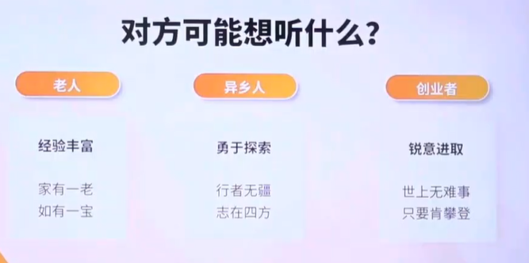

## 靠近: 如何快速获取对方信任

八卦

### 选择性暴露

- 价值观经历【价值观是一段故事，是一段经历】【你为什么会有这样的看法和观点，你为什么会这么思考问题】
- 私密的对话，人会更在意形式，而非内容
- 尴尬的情节【 聊优点不如聊缺点， 聊好的不如聊坏的】【学会把不好的东西将给别人听】

## 怎样让你八面 玲珑，跟所有人都聊得来？

什么是善解人意？不是我能“**理解**” 而是对方感到“**被理解**”

善解人意”一定需要我真的懂你吗？ 有时候，沟通的情绪价值，大于信息价值

### 针对个性

- 针对群体

::: details 对方可能想听什么

:::

- 反向挖掘【平常没有人发现，但你却注意到了】

  - 大家都觉得你…，但在我看来…
  - 你虽然看起来…，但是不是有时候也…

学会夸一个坚强的人柔软，夸一个柔软的人坚毅，夸一个有钱的人有趣，学会夸一个有趣的人有趣是钱也买不到的东西

- 关注过程

## 迎合：怎样让对方爱上和你聊天？

对话的时候什么最尴尬？
硬聊？沉默？强颜欢笑？
**然而，这些情况，只要你越积极，就越会发生**

**所有的沟通都是在消耗情绪**情绪消耗完，沟通就断电

- 保持积极，就是给对方的情绪充电
- 接受讯息，是在增负
  分享讯息，是在减负
  好为人师”是人的共性

把沟通留给值得的人【好的情绪，好的反馈】取悦并非谄媚，而是寻求更好的，对话策略，更好激化对方的表达欲

如何做一个好的倾听者

- 好奇【给夸奖不如给**好奇**】
  - 好奇打开话题
  - 给出夸奖，你将听到“**哪里哪里**“一一夸奖是一种“**终结式**”
- 到达【如果这是一对多沟通，你会怎么彰显到达】
  - 点头、注视、笑声、重复话语 ，**给出“注意力”是最大的馈赠**
- 启发【没有人能抗拒改变他人】沉思后豁然开朗会让对方更有成就感
  - 所有  我知道的事  都用于证明“  你启发了我 ”

## 男女沟通

你渴望真相，而我渴望体验

如何表达反对意见？亲友：先对人再对事

> 我肯定是支持你的，不过下次可以处理得再........

关系的延续，关系的展开，本质都是情绪的交流，而不是问题的解决

亲密关系的本质，情绪的互动与碰撞

思维**陷阱**，**表达**差异

- 反对的观点【先对人再对事】
  - 我不需要你理解**问题**，我需要你理解**我**
- 提问的意义
  - 对有些人来说，提出一个问题，是为了获取答案
    一一**我不问，是因为我没有要求**
  - 对另一些人来说，提出一个问题，是为了开启交谈
    一一**你不问，是因为你不想交流**
- 对话目的【情绪和感受，而不是最终的感受】
  - 好的做法
  - 延伸分享
    - 说到这个我突然想到...
  - 说出情趣
    - 你现在很委屈/失望/开心，对吗
- 回应式短语【回应式短句提供的不是具体的信息而是你与对方的**「连接感」**】
  - 嗯
    我明白
    这样啊
    天呐
    我在听
    没错
    Oh gosh
    原来如此
  - 重复句尾，延续对话

互补
往往意味着
不那么相似

沟通起来我们之间的表达思维确实不一样

对方并没有恶意，只是对方和你看问题的视角不一样，你会释怀很多

两个人越相似，两个人之间的沟通的成本门槛越低，但意味着亲密关系的模式和可能性，就不会很丰富，往往不相似，往往互补，才意味着两个人之间有更多的可能碰撞出来的可能性

## 情绪沟通

### 类比

学会用更多形象化的词语，解读自己的情绪与感受，存储与记录自己的情绪

例子：我很难过，我感觉像是有人拿烟头了在我心上狠狠烫了一下，还转了个圈。

###  换位

用他的某一刻的生存处境，来映照自己的生存处境，这个过程中可以发生灵魂的共鸣

句式：就好像当你遇到xxxxx那样的心情

例子：我没有不热情呀，就好像你工作特别忙的时候，我去找你，你也会有点迷茫，不是因为不热情，而是因为不知道怎么办。

### 前因

为什么你会感到xx? 【参与到对方的高兴中】

我好开心啊，我最希望得到的就是他人的认可，所以这件事情做成了倒不，是因为有奖金而开心，而是我觉得我的努力被人承认了。

### 后果

我遇到的这件事情，让我现在想要......

我好丧啊 , 我现在只想好好吃一顿酸菜鱼，出一身汗，然后走回家，睡一觉，最好明天也不用去公司。

### 如何解决情绪

说出对方的情绪就是在解决情绪，命名一种情绪就是在解决情绪，把这个情绪扩充成一个故事，扩充成一段经历，扩充成一个氛围，扩充成加下来要做的事，就是在解决情绪

说出你此刻所有的想法不必筛选

情绪不被说出口，就无法真正存在

## 知觉合验

TA真的是在跟我作对吗？

害怕孤独而发出的求救  【你别着急=你别求救】

我以为澄清事实， 矛盾就会消失？【事实，是你被筛选出来的，你看到的，住住是你在意的部分事实】

少谈事实，多谈客观感受

你做了什么，我的感受是什么

解决冲突的实质【 表达自己的情绪， 承担对方的情绪 】

### 描述所见事实

 

### 给出两种诠释

尽可能地给出一些中性的诠释

吵架之后，她关上了门

两种诠释
1.她情绪低落，想一个人静一静。
2.她不小心力气大了，并不是摔门。

你的诠释 

她就喜欢用冷暴力，一吵架就不理人，耍小性子

### 请求对方澄清

吵架之后，她关上了门，可能想一个人静一静，关门时不小心用力太大。
请求澄清【我怕我误会了，你能告诉我怎么了吗？】

你的请求【你今天必须给我说清楚，不说清楚谁都别睡觉 】[逼迫对方回应]

## 怎么成功说服别人做出改变

**损失厌恶，是进化的智慧**

- 稀缺的故事引发注意
- 用损失激发斗志
  - 怎么劝别人上进？不要强调价值，要强调损失
- 用限制刺激改变

