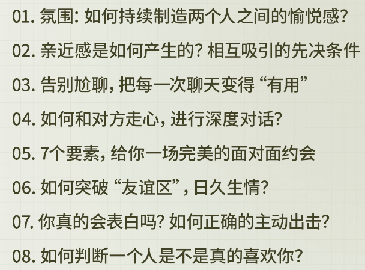
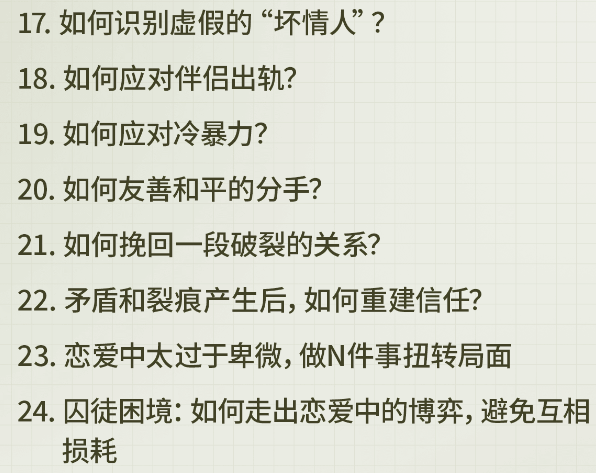

# 课程大纲

## 凭感觉恋爱是件危险的事

> 初始认知--->实践反馈--->修正认知

提升恋爱认知，恋爱能力，--> 少走弯路 科学告别单身，收获长久高质量稳定的恋爱关系

正确的恋爱认知--> 高质量得稳定的恋爱关系

> 我们每个人都是不完整的，也终其一生都在修补自己，恋爱并不是让我们去依赖一个人，而是通过和他人的相处，更加了解自己，也更懂对方

> 我们可能不需要一段伟大的爱情，但我们需要一个靠谱的恋人，一段靠谱的关系

::: details 点击查看完整课程大纲

:::

## 模块一

::: details 有关“吸引力”的展示和“好感”的产生

:::

## 模块二

::: details 恋爱阶段的维护，深入，以及稳定恋爱关系

:::

## 模块三

::: details 恋爱阶段（包括长期关系）的危机情况处理

:::

## 模块四

::: details 恋爱中的自我提升和修养

:::
