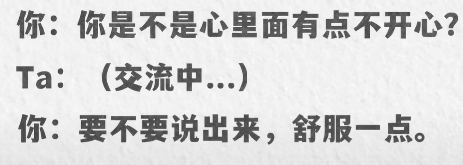

# 如何和对方走心，进行深度对话

## 走心，深度对话

1. 什么是走心？【 是“懂得”。是以情绪作为媒介和载体在传递信息】【懂得其实就是信息需要情绪作为媒介和载体被传递出去，并让对方感受且认同这种情绪】

::: details 怎么才算是聊到深处了?

那怎么才算是聊到深处了？换句话说，怎么才算是亲密关系中的走心呢？其实我们换一个词就很好理解了。没错，就是懂得，是一种我懂你，你懂我的感觉。虽然懂得和了解两个词看起来意思很接近，但是这两者之间有一个最显著的差异，就是了解它可以是单纯的信息交换，它可以是冰冷的，是理性的，但懂得怎么样，他通常是伴随着情绪的，而是带着感情的，是感性的。就像我们看相亲资料，对方的年龄、学历、家乡工作、家庭条件、兴趣爱好、大致的情感经历可能都会写在上面。我们会对这个人有一个还蛮全方位的了解了，但我们不会说我们看了一堆资料就懂他了，这就是区别，因为这些信息只是信息，是不带谦虚的，也没有温度。说的再简单一点，了解和懂得是什么，就是 i know 和 i feel 的区别。

:::

2. 被动条件

- 天时，合适的时间。(夜间更好)【晚上乃至深夜的时候进行走心聊天，往往会事半功倍，如果可以的话，会比白天更好一些】
- 地利，适宜的环境【能见面就不要语音，能语音就不要打字】【安静，私密的环境。】

  ::: details 安静环境的原因

  安静私密的场合肯定比吵闹、人来人往的场合更适合我们去谈露心声。一方面在这种环境里面，人的精神状态会更加的松弛，我们思考和表达都不太会受到外界的干扰，并且一个合适的环境会给我们提供更多的安全感，不怕被不重要的人听到吧

  :::

  ::: details 为什么要避免打字

  我们的聊天方式，事实上文字和语言对于情绪的承载能力是完全不同的，单纯的出现在屏幕上的文字是最弱的，即便我们加上了标点符号，表情能传递的情绪也是极其有限的。所以微信打字绝对不是一个好的走形环境变化会好一些，因为加入了语气，语调的变化，能承载的情绪也更多了，而面对面交流，是吧？就更上一层，讲的生动，所以我们想要达到最好的走形效果，能见面就不打电话，能打电话就不发文字。

  :::

- 人和 ，关系状态

  - 信任【交流是顺畅的】【ta 不会因为隐私而对你产生困扰】
    ::: details 怎么才算是信任

    第一，你觉得和对面的聊天是顺畅的，能聊得下去，能和他说的了。
    第二，他不会因为知道了你的某些隐私而对你产生困扰，这就能解释为什么很多时候我们不愿意把心里话对父母说呢。第一，聊不下去，代沟太大了。第二，父母一般都会因为知道了我们的某些状况，隐私来干预我们的生活嘛。而笔友，是啊，我可能都不知道对方的真名，但不重要，我们能聊得下去，也不会有隐私暴露而产生的生活上的困扰。

    :::

- 对方今天情绪能量如何？【他是否愿意进行长时间的深度聊天？这个也是关系状态】

::: details 对方今天情绪能量如何？

人们一般都会在特定的时候产生倾诉欲。比如一个人，他今天就是闲，他可能倾诉欲是爆棚的，逮着谁都想聊心事，有可能，哈哈。再比如对方今天累不累，对吧啊？这种聊天也是很耗费精力的，所以有的时候可能天时地利都没问题。但两个人当中的任何一方如果不在状态的话，这种深度对话也是很难进行下去的，

:::

3. 主动走心的 4 个步骤

   - 描述状态【**描述对方当下的状态**】【你现在好像有点低落，你不说话是不是想到了什么事情？
     你是不是心里面有点不开心？
     刚才的事情好像让你有点惆怅，
     你看起来像是若有所思的样子啊。】
     - 描述意义【意义就是让对方知道。嗯，我们非常关注他的情绪状态变化，我们也很愿意就着他当下的状态和他聊下去】
   - 引导表达
     ::: info 例如

     - 可以和我说说吗？
     - 如果你愿意说，我想听听
     - 你要不要说出来舒服一点？
     - 如果你相信我的话，可以和我说一说。
     - 来嘛，来嘛~ 我想听了

     :::

   - 支持性回应【对方正在担心的事情、忧虑的事情，这些感受是合理的，是重要的，也是应该存在的。 】
   - 认同情绪
   - 【我知道这种感觉，所以我懂你现在的感觉我能感受到那是一种失落感，我记得我曾经也有过这种感觉，我知道这种感觉不好受】

::: details 第一步第二步加起来的表达

:::

::: info 示例

第一步，描述状态，当我们察觉到对方有情绪出现，有情绪波动的时候，去描述对方当下的状态，对方有可能不一定愿意说，所以我们最好加一。

第二步引导表达，带一带他，哈哈。

第三，支持性回应啊。这里面我们也举到了反例，什么叫不支持回应，以及一个很好的支持性回应的方式，讲故事，讲一个我们也发生过的类似的故事。

最后认同情绪，注意认同的是情绪本身，而不是事实。

:::

4. 变种【也可以通过自我暴露来开启走心对话，就是对方可以有心事你也可以有嘛？也就是说我们之前的第一步描述对方的状态，现在赶过来描述我们自己的状态，主动的告诉对方我当下是什么感觉，这同样也是起到一个钥匙的作用】

   - 描述你自己的状态
   - 确认（对方)意愿【你想听吗？】【目的：让对方提前的进入一个状态，毕竟是你的心思，不是他的】
   - 表达和等待支持性回应
   - 认同情绪 一一认同不一样的情绪【虽然对方产生了情绪，但不一定是和我们一样的情绪，我们也可以去认同这种情绪】

::: details 示例

:::

::: warning 变种

主动描述自身状态 + 确认意愿 + 表达和等待支持性回应 + 认同对方情绪

:::

5. 2 个阻碍走心的因素

   > 如果我们某一天和一个人唉，走形失败了，我们可以反过来看看，是不是这两点出了问题

   - 心智水平
   - 价值观取向

6. 三元素的重要性
   氛围 ，亲密感，走心【氛围加上亲密感加上走心，就可以囊括了吸引力。而一般两个人之间具备了三个元素中的任意两个，也就是已经具备了我们通常意义上说的恋爱的条件】

::: details 举例

如果两个人之间只有亲密感会发生什么？想一想没有走心，对吧？没有两个人之间情绪类的深层次交流，也没有氛围，对吧？意味着两个人日常呆着在一起玩也不会很开心愉悦，而只有亲密感，只有性别之间的渴望的话，那不管我们口头上怎么去定义我们之间的关系，是恋人还是别的什么，实际上只有性别渴望的话，必然两个人会走向一个非常肤浅的关系。你知道的好，只有氛围会发生什么？嗯，没有亲密感就没有性别之间的渴望，没有走心。嗯，就没有深层次的交流。一样的，别管口头上怎么定义两个人关系，实际两个人的关系是什么？其实更像一种玩伴，那如果只有走心，没有亲密感，也没有氛围好，我就不啰嗦了啊。实际关系更像什么？像知己，所以我们排除掉所有的外部矛盾，比如年龄差这些我们现在就可以来尝试着回顾一下，为什么我们曾经没有和某个喜欢的人成功的走到一起？或者经常发生的这种走了几天个把月就散了，一定是 3 个元素中缺少了 1- 2 个元素，就起码最少也得有一个元素才能够至少发生一些碰撞，如果一个元素都没有，那连这都不可能。而一般两个人之间能够激发出两个元素，才能够形成一段正常的亲密关系的基础，而且有意思的是，其实可以是任意两个元素的组合。就这十年来，我观察了大量的咨询案例，但凡是能够比较恩爱的走下去的情侣，一般都会拥有至少两个以上的元素。

:::
