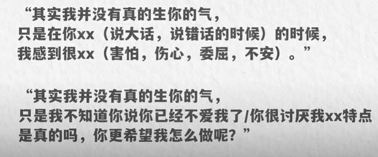
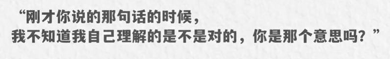

# 吵架？如何正确的表达意见和情绪？

## 表达情绪

::: tip

陈述事实+表达情绪+提出建议【发生了一件什么事情，这件事让我有了什么感觉？以及我希望怎么做才能够改善情绪或者达到一个好的结果】

面对冲突，我们情绪上头的时候要收的住，还要去和对方心平气和的交流，多少有一点反本能的意思，所以我认为这种技能是一项需要刻意练习的技能，这项技能能够让我们更加的也了解自己，知道我们自己真实的情绪和需求是什么，也会让我们更加有能力去处理这样的局面，维护两个人的感情，让两个人共同去对抗问题，而不是对抗彼此。
:::

- **陈述事实**（就是论事，避免用“你”开头，换成“我”或者“我们”开头）【聚焦在引发我们情绪的那个事实上】
  - 我们要就事论事，聚焦在引发我们情绪的那个事实上，方法就是避免用你开头而换成我或者我们开头，这个话术能大幅度的降低攻击性
- **表达原生情绪**【在表达之前，我们要先回忆一下噢，那个原生情绪是什么？然后说出来让对方知道就可以】
- **提出建议解决问题**【优先是解决问题还是解决掉情绪呢？其实都可以，重点在于做商减的事情，商减的意义在于不让事情变得更加混乱、恶化，而是变得更加清晰、简单】

::: tip

经常的用你怎么样来开头，潜台词就是在说你应该做到某件事，但你却没有。所以你做错了这个比较容易让对方感觉到委屈、生气，导致冲突升级。所以想要温和不带攻击性一点，就把你换成我，或者我们来开头。

:::

::: details 陈述事实

**我或者我们来开头陈述事实，也能够尽可能的避免误会带来的冲突**

同样的事实，两种表达方式，

你已经两天没有联系我了

我们已经两天没有联系了。

如你今天很晚才回来

我今天一个人在家里坐了好久

:::

::: details 表达原生情绪

这部分的重点在于表达原生情绪，而不是次生情绪。我们在不知不觉中在表达情绪的时候也会带着情绪来表达。这个时候我们表达出来的很可能就不是那个事实给我们带来的情绪，而是经过了一系列发酵之后的情绪，而最原始的那个情绪会被遮盖掉，情况就会变得复杂，

我们常说本来一件事没那么生气，结果越想越气，而后面的这个生气怎么样，就是自身情绪，它并不是原本那件事带来的，而是因为这件事情我们又去发酵、去联想，从而产生的

**通常情况下，愤怒和生气都不会是原生情绪，都是自身情绪**

我们常说恼羞成怒，其实就这个意思。懊恼和羞愧才是原生情绪，因为我们没办法处理懊恼和羞愧，所以才会衍生出愤怒。所以在表达情绪之前，我们要去回忆一下，要去把那件事情给我们带来的原生情绪给扒出来

例子:

你对象两天没联系你，你的原生情绪是什么？那个最初的产生的情绪是什么？可能是惦记、是害怕、是关心都可以。那我们只要表达惦记、害怕和关心就可以了。比如我们已经两天没联系了，我不知道你那边发生了什么事情，我很关心，也很惦记你。OK，结束

所以表达情绪的重点不在于怎么说，而在于说什么。把我们的原生情绪表达出来，让对方知道就可以了。而通过原生情绪产生的一系列自身情绪故事，

我们要表达，我们要能收的住这种对原生情绪的表达能够更准确的让对方和我们自己知道我们现在的心理处境。对方只要理解了这种心理处境，

那其实两个人的矛盾是很容易被解决的。而最要命的是那些次生情绪，比如焦虑，我觉得你想跟我分手了，我觉得你不爱了，甚至会觉得自己羞耻，觉得自己怎么这么粘人，恋爱脑别人都不惦记你了，你还这么惦记人家，这些东西叠加在一起爆炸了。
:::

::: details 提出建议解决问题

> 例子： 比如对方和公司的异性在微信上聊了几句，我们不爽了，解决问题可以是，那你以后就不和他聊天了，或者你当着我的面告诉他你有对象了。也就是我解决情绪，可以是，唉，你来哄哄我，或者你真诚的向我道歉

**有些问题一时半会还真解决不了， 我们压根就给不出解决方案**

比如异地恋，我想见面怎么办？

这个问题解决不了，那作为另一半就只能先试着去解决情绪。多安抚、多陪伴、多联系，给到足够的安全感，同时也有可能倒不是说因为解决方案提不出来，而是当下的情绪太过于强烈了，以至于我们根本就不会想去解决问题，俗称气傻了。

这个时候很明显，如果不解决情绪也解决不了问题好那么大，这个到底谁先谁后啊？有没有一条简单的方法论呢？我终于发现其实很简单，就是做商减的事情

**两个人有一个矛盾的时候，商值很小，但矛盾会引发情绪，情绪又会引发新的矛盾，新矛盾又会引发更新的情绪，然后这那于是就变得很混乱，也就是商增，所以我们不希望商增，那我们就应该去做商建的事情，所以有了这条原则，面对不同的事情，我们就知道优先去解决问题还是解决情绪了，我们就看先做什么有利于商解，对吧？现实一点，我们可以先提出解决方案**

不管是我们还是对方提出的这个解决方案，双方都是满意的，那么很好，问题解决了，情绪也很可能顺带的就被解决了，

反过来也不排除有些时候我们提出了解决方案，或者对方提出了解决方案，另外那个人更加不爽，会觉得你压根就**不关注我的情绪**，你压根就不关心我，就知道解决问题解，对吧？这种情况也常有发生了。
那如果遵循商减原则，**优先要解决情绪，先去安抚对方，或者被对方安抚**

我们可以直接去建议对方来做些什么，协助我们消解掉这个情绪，是吧？可以在口头上去哄对方，或者做一些让对方会开心的事情，或者直接告诉对方，我希望你来哄我，你去给我削个苹果，也就是说不管怎么做，先做哪个？我们的目的就是商笺，只要能做到商笺就可以。

我们得承认，确实有一部分人他的情绪反应会比一般人更加强烈，情绪来了就没办法好好解决问题。那既然情绪已经出现，而且他阻碍到我们，那我们就应该去直面他，把它搬开。这就是商减，对于一个已经困在混乱的情绪里面的人来说，这会有利于他和对方一起去解决问题。

一些情况其他的概念解释不了，只有伤可以，比如说两个人出现矛盾之后，就是互相坐在那冷静了一段时间，好了，对吧？这种情况既没有解决问题的动作，也没有解决情绪的动作，就是因为互相坐在那冷静的过程，就是商检的过程，这不是单纯的简单和复杂能解释的了的。

:::

## 吵架

1. 不表达情绪的吵架 【两个人吵架的目的不是为了表达感受，解决问题，而是要战胜对方】
2. 表达和宣泄情绪的吵架【如果是在沟通，可以拉近关系，互相了解】

   > 因为如果两个人是在沟通，只不过是形式上比较夸张一点，那么在这种吵架之后，情绪平复之后能够有合理的善后，的确可以让两个人更加互相了解

3. 正确(温和)地表达情绪 【陈述事实+表达情绪+提出建议】

冷暴力通过沉默和冷漠让对方感到不舒服，以此在博弈中取得胜利和对方的服从。这种方式不表达情绪，不在乎对方感受，阻断所有沟通可能，造成的伤害极大，是破坏关系最严重的一种方式。
::: details

你知不知道我们刚刚坐在那里互相不理，我真的很难受。你知不知道我也会没有安全感？我一直都希望你什么时候能够主动找我一次

:::

## 吵架后的修复

- 试探【根据对方的反应做出下一步的行动，不然动作太大容易激发对方的逆反心理，也造成伤分】
- 澄清 【澄清也是一种梳理，既帮对方梳理，也帮我们梳理。最大限度的把吵架的破坏性降到最低，加深了解和感情】

::: details 试探例子

试探其实做具体什么事情不是最重要的，而是在什么时机做，我们应该实时的捕捉到对方的情绪状态，然后做试探可以是任何事情，包括但不限于主动帮对方做一些家务，

给他买一份他喜欢的吃的，销个苹果，提供一些小的服务。微信上发个认错表情包或者发个小红包，主动询问他要不要一起去做某件事情，或者直接问，你还在生我的气吗啊？有无数种，

但一定是小的动作，因为对双方来说，刚吵完架之后的情绪都比较敏感，一上来就用很夸张很大的动作去示好，比如壁咚，这就是电影看太多了，最好用小的行为在对方的舒适区之内进行循序渐进的试探，这在干嘛？这就是在商检呐，这种试探就是为了让局面不再变得更加混乱，也不让两个人的情绪更坏了。
比如吵完架之后，我蹑手蹑脚地坐在他身边，这在干嘛？这在拉近物理距离，

看一下他会不会有什么反抗，会不会直接走开？如果有，那我们就先撤回来，我们拉开物理距离，我们先啥都别做，如果没有，或者他给了我们一些好的反馈，转头看我们，那我们就可以尝试进一步。唉，去牵牵他的手，拍拍他的肩膀，如果反应再好，我们可以有一个拥抱，这就是循序渐进的试探

:::

::: details 澄清

澄清什么？澄清这个架为什么会吵起来？我当时情绪为什么不好？为什么我没有及时的来哄你啊？为什么我选择这么做而不是那么做啊？为什么我说了言不由衷的话，为什么刚才对你人身攻击了？以及我，我最不能接受？你刚才说了什么？做了什么？在我看来哪些事情是造成事态的升级和冲突的？包括对方的某些话我们可能没理解，我们可以再问对方，刚才你那么说是什么意思？我理解的对不对？这些等等，就是回答为什么这个架会吵起来？我强烈建议我们要做这一点，即便是在两个人和好如初之后依然要做。

如果我们没有去事后澄清，我们或者对方中的任何一个偷偷的把一些东西当真了，即便表面上是和好了，但那根刺也扎进去了。而澄清就是拔刺，这是一种梳理，帮对方梳理，也帮我们梳理，这样以后我们也能够在潜意识里面尽量的意识到怎么避免这种情况，我们脑海中会出现一个预警。当类似的局面好像出现了，我们就可以快速的预见到，然后避免掉它，所以这个绝对是有利于长期关系发展。

:::

::: details 澄清举例

可以把这种澄清理解成一种复盘，一种对吵架的查漏补缺，我们对对方袒露了我们真实的情绪，也表达了我们真实的需要和恐惧，也提出了希望和对方重建关系、解决问题的诚意，这就会把吵架所带来的破坏程度降到最低，也从中进一步的去建设关系，加深感情的长久稳固

:::
