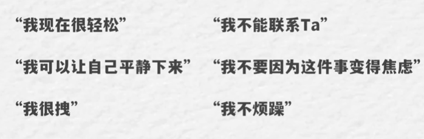

# 恋爱中太过于卑微，做 N 件事扭转局面

::: danger

我们可以**时刻的来提醒自己**，我们现在要做某件事情，是不是对我们的**关系长期的发展**是**利大于弊还是弊大于利**？
如果是**利大于弊**，那就**当成是正当的需求去做**就可以了。

如果是**弊大于利**，那反过来就可以**当成是需求感**了，
那么当我**明知道后果去强行施加这种需求感**，就是**等于伤害关系**的时候，就等于**和长期的目标背道而驰**的时候，

那我还要这么做吗？我还要坚持**破坏**掉这个**长期目标**吗？是吧？

当能够考虑到这一层的时候，大家就会更有**动力**，一种更**深层次的动力**来**自我控制**，来是**规范自己的行为**，
所以关系的**良性发展**作为**长期目标去指导行为**，它更像是**一套思维方式**，**一套自上而下的思维方式**，

**确立长期目标，辨别行为，然后实行，最终实现关系的良性的整体运作，也就不存在需求感的问题**。

:::

## 需求感是怎么来的？

就是当对方暂时没有满足需求的时候，我们想要执意的满足这个需求，就变成了所谓的需求感
::: tip

喜欢又求而不得的时候，人们难免会产生一种急切的冲动，想要去获得对方的回馈，这种迫切的常获得某种回馈的感觉就会进一步加强。我们越是求不到，越是迫不及待的想要。

甚至可能会被这种想要支配变得情绪化，忍不住地做出一些非理性极端的行为，去赌气、去闹、去找茬等等，是吧？需求感开始疯狂的暴露

:::

::: details 例子

我们经常说谈恋爱的时候要降低我们自己的需求感，那么需求感这个东西到底是怎么来的？

- 比方说最常见的我们喜欢一个人的时候，肯定想和对方聊天联系，于是我们会给他发消息，好到这里没有任何问题。
  而重点来了，如果这条消息发过去，隔了一个小时、两个小时甚至更久对方没有回复的话，我们会产生什么感受？可能会非常焦虑、非常沮丧、猜疑，于是落实到行为上，我们可能就会去给他发第二条、第三条，甚至直接给对面打电话，跑到对方家路下说要见他，甚至我见过有见到之后还要质问对方你为什么不回我消息？其实后续的这些情绪和行为才叫做需求感

- 我喜欢一个人，我肯定想要和对方腻歪，亲亲抱抱，产生一些肢体上的接触，对吧？如果对方接受了，这就是一个需求，被满足了没毛病。但如果对方还不愿意和我太过的亲密，我还非要凑过去，执意满足需求，就变成了需求感啊

- 我们喜欢一个人，总是想要见到他，想要和他约会，如果对方接受，那这就是正常的需求。如果对方没空见我们，我们还非要缠着他，我们还非要去见他，甚至在对方忙的时候还非要见他，对吧？执意满足需求就变成了需求感，所以你看，需求和需求感虽然有所不同，但其实是一步之遥。

:::

## 需求感有什么坏处？

- 对一个人的需求感越高，我们被他牵引出的情绪波动就越大

- 这容易导致博弈层面的失利和对方的不珍惜

::: tip
需求感容易把我们的心态搞崩，让我们的情绪变得特别不稳定。我们都知道对一个人的需求感越高，那么因为它被牵引出来的情绪波动就会越大，这就是我们俗话说的无欲则刚，关心则乱，就是这个意思。
而心乱的时候，我们通常就不那么冷静了，也容易做出一些冲动的决策和行为，

- 像是典型的微信聊天的时候，别人发一条，我恨不得立马回 10 条，一直想要拉着对方聊天，想要知道对方正在做什么等等，那对方其实是可以感觉到这种需求感，我们在博弈层面就会变得更加卑微一些，
- 约会的时候经常有同学也是这样，都是别人有空了才见我们，但我们可以推掉所有的事情去抽出空来见他，其实同样对方也可以感觉到，也会让我们变得更卑微更弱势一些

不是因为我们真的比对方差或者低人一等，就是因为需求感如果过于强烈的话，会导致我们看起来自降身价，而问题是这种妥协和迁就并不会换来我们的需求被满足，恰恰相反，还会比较快的失去对方对我们的新鲜感和尊重。而越是这样，很多人的心理就越急迫，需求感就愈发的强烈，于是什么都不管了，上去哄上去缠着对方，进而对方经常的在这种负面情绪或者压力的驱使下，他就会彻底的合理化这些行为。合理化，自己好像还是蛮优秀的，很有市场的。这种感觉甚至会因为是对方配不上我，哎，不然为什么你需求感那么强

:::

## 自我克制

::: tip 我们越喜欢对方，对方就越不珍惜。

其实这句话没说完整，不是我们喜欢一个人对方就不珍惜，而是我们喜欢一个人，进而暴露出过高的需求感，让对方觉得我们配不上他的时候，对方才不会珍惜。所以这背后的逻辑其实就是过度的需求感导致了我们在博弈层面的败北，所以说到这里我们也就明白了，需求感过强确实是不好的。一方面把自己搞得卑微，一方面还不讨好

:::

### 语言暗示

不断的重复默念一句话或者一个关键词
尽可能的用肯定的陈述+积极的词汇，尽量不要用否定的陈述+消极词汇

::: details 语言暗示
语言暗示，简单来说就是通过和自己试着说点什么，让自己的情绪平复下来。我们都知道语言是有暗示力量的，如果我们不断的重复默念一句话，它往往就会被我们的大脑所捕捉到，内化成我们认知的一部分。所谓谎言，重复一千遍就会变成真理，就这个意思，很多政治家也深谙这个道理，特别是当他们作为候选人去竞选演讲的时候，会经常的用到这个技巧。所以我们如果可以找到一句让我们自己情绪平复的话，或者是一个关键词，那么我们就可以不断的去重复它，说出来大声点都没事，通过这个方式来做到自我暗示。

只要我们可以用肯定的陈述加积极的词汇的时候，就尽量不要用否定的陈述加消极词汇。肯稳定陈述加积极词汇，比方说我现在很轻松，我可以让自己平静下来，甚至是哎呦我很拽的效果会比我不能联系他。我不要因为这件事变得焦虑，我并不烦躁，要好得多，因为潜意识对这种积极和肯定的信息会更加敏感。肯定陈述加积极词汇会帮助我们更好的来接受这些信息。相比之下，否定的陈述和消极词汇有可能会让我们的思绪变得更加混乱，产生一些矛盾和冲突

例子

- 如说那个经典的大象实验，就是同学，现在请你脑海中不要去想象一只大象，好吗？这个时候你大概率是已经想到了大象的这个实验，让人们发现，越是让人们不要去想某个东西，他们往往容易出现反效果，更容易想到这个东西，这种现象被叫做思维反弹

心理学上的解释是，当我们试图主动抑制不去想某些意念时，我们的大脑往往会不自主的想到这个意念

**那我们怎么做会更高效，对吧？**

我们可以不妨直接告诉自己，我去想象一块蛋糕好了，这就是为什么尽量用肯定的陈述加积极的词汇，大家以后也可以试一试啊。我觉得很神奇，也很有意思。
:::

### 改变环境

**换一个环境转移注意力**

改变环境，也就是我们常说的转移注意力了，就是说单纯的去做另外一件事情，我们还不一定能做到。但是如果换一个环境，周围的氛围和磁场改变了，我们是比较能够去转移注意力的
::: details 换一个环境转移注意力
发现当我们的注意力过于的聚焦于某一件事情或者某一个人的时候，他好像是会产生一种氛围或者是磁场的感觉。

- 这个时候换一个环境，出去走一走，吹吹风，看看外面的草地，呼吸一下新鲜空气，或者我找个地方去嗨，
- 都有助于让我们把注意力从那个聚焦的事情上移开，
- 特别是我们在等某个人回消息，等的心烦意乱的时候，闭上眼都是那个手机对话框，这个时候即便我想做点其他事情也做不到。

而当我们换了一个环境之后，我们的周遭的感觉全部变化了之后，其实我们更有助于把注意力挪开，那怎么样焦虑或者说需求感的程度也就随之减轻了？对，这确实是我们日常最常说的。转移注意力，这不新奇，但确实是立竿见影的，所以我认为这算是一个惯用的方法
:::

### 自己和自己辩论

我们可以像上面一样，唉，来做一场自我辩论，驳斥这个念头。

自我辩论不是为了获得一个真相，它其实是一个自我梳理的过程，这有助于让我们换个角度去看问题，不要钻牛角尖

::: details 自己和自己辩论

做其实你什么都不用担心，就说你觉得生活中有烦恼吗？如果没有，那你还担心啥？如果有，唉，那你能解决吗？如果能，那你还担心啥？如果不能，那你还担心啥？

如果我们脑海里有一个念头，就是我要找他，我要联系到他，我要见到他，那我们可以像上面一样，唉，来做一场自我辩论，驳斥这个念头。 像是我必须找他，

- 对吧？要见到他，这有什么好处？又有什么坏处？
- 我不找他可能会有什么样的后果？
- 如果我现在我就是不能找他，我是不是自己就活不下去了？如果我找了他，
- 他回了我又能怎么样？如果不能，我为什么要找他？

通过这种自问自答来做自我辩论，这不是让大家去**找出一个真相**，而是让我们**不去钻牛角尖**，帮助我们**换一个视角来看待问题**，就这些问题的答案最终得出什么样的**结果并不重要**，而是这个**自我辩论**的过程本身就是一个**自我梳理的过程**。通过这种自我梳理，我们经常就可以**说服自己**，没必要**做一些吃力不讨好的事情**

如果你不知道怎么去自我提问、自我辩论的话，有一个相对简单也笨一点的方法，就是我们列出两列

- 左边是我要做这件事情的好处
- 右边是我不做这件事情的好处

看看哪边能写的更多,事实非常有意思，都是写到一半就得出一个结论，我不想写了，我现在也不想找了

:::

### 找人聊聊

找人聊一聊，这也会让我们把关注点放在眼前的对话上，减少这种胡思乱想

::: tip
找人聊一聊，就说如果上面的方法我们都试过了，实在还是没办法自我克制，那么不妨也可以试着找其他人聊聊天。不管是聊聊我们当下的困惑，还是聊聊其他的事情都可以，只是注意我们并不是去向别人寻求某个意见或者方法，而是通过这样的聊天，我们经常就会打开全新的思路，在这个和别人交互的过程里面，让大脑自己去理清楚一些东西。

:::

## 如何不违背恋爱的初衷，长期的降低需求感？

::: details
这些是比较直观的方法，是一种短期的克制，但如果要说真的去平衡关系，为了获得对方的尊重，上面这些还不算是长久之计，

- 因为只要我们是真的喜欢一个人的时候，肯定是会伴随着很多需求的，基本上没有可能我们既喜欢一个人，又对他完全没需求，
- 你跟不跟我联系没关系，跟不跟我见面没事，甚至你喜不喜欢我都没关系，对吧？不可能，我们一定会在意这些，所以如果我们短期的去压制克制可能还行，
- 但如果把这个时间维度拉长，看长期关系中难道要一直克制吗？对吧？那上面这些方法看起来就和非常吃力了，但是把时间维度拉长在长期关系中，除非我们删除掉这种需求，
- 但那又不可能，需求就是有正当性的，是谈恋爱的时候删不掉的东西，所以像是我不要去关注对方，我完全的把注意力放在自己身上。
  是，这确实是降低需求感，但他同时也是在教我们减少对对方的需求，教我们如何去不喜欢一个人，
- 所以这就成为一个悖论，如果我对一个人没有需求，那说明我不喜欢他呀。既然不喜欢，那还降低什么需求感，人家不用在一起了。

哈哈，所以讲到这里好像进入了一个死局。我要说这个时候我们就必须上升一个层次，站在更宏观的思路来看待这个问题，也就是如何不违背恋爱的初衷，长期的降低需求感

:::

**如何不违背恋爱的初衷，又长期的去降低需求感呢？**
::: tip

有了长期目标，我们才比较容易能够去区分我们要做的某个行为究竟是属于正当的需求，还是需求感，是应该做的还是不该做的，正当的需求一般是不会让人产生反感的，而我们开始就解释了需求感会，既然这两者的区分来自于长期目标，那长期目标就显得非常重要了

**长期目标**

- 它是代表了我们想要的最终状态或者一种追求的愿景
- 所以长期目标通常宏观，并且具有激励性和指导性
- 一个正确的长期目标一定是对关系有良性发展的

:::

核心以关系的良性发展作为长期目标去指导行为。
有了长期目标我们才能比较容易区分我们做的某个行为究竟是属于正当的需求还是需求感。
这不是一个简单的方法，而它其实是背后的一套思维方式，确定长期目标，辨别行为，然后实行最终实现关系的良性的整体运作，需求感自然而然也就下降
::: details 例子

比如我想要健康的身体，这是个长期目标，

如果为了这个长期目标，那我们就会去早睡早起，锻炼身体、控制饮食，为了身体上的良性发展，在任何时候、任何场景下，该做什么不该做什么，我们也就非常清楚了。

**短期目标有可能对关系产生不好的影响**

我们说最现实的例子就像是非常常见的，我们在谈恋爱的时候不想让对象和其他异性产生接触，这是一个目标，

但这**不是一个良性且长期的目标**，它是一种**控制**，其实是\*_恶性的_。

- 按照这个目标行为上我们自然的就会尽可能的更多的占用对方的时间和精力，对吧？我们于是就开始不断的联系对方，要和他见面，要求他陪着，不让对方有任何喘息的机会，也剥夺对方独处的空间。短期来看这确实能实现，而不让对象和其他异性接触的这个目标，但长期来看怎么样？这会让对方出现反感，让对方心理去积压一些东西，这会破坏关系，这就不良性了，这种不良性的状态一直走下去，对方有可能有一天就窒息了，会更加想要离开我们，彻底的不再提供这些时间精力陪伴。所以如果长期目标跑偏了，行为上也注定会跑偏了。

**良性长期目标**
从关系的发展的角度去看待问题。简单的说，大家可以尝试把我这个出发点换成我们之前是我和他联系哦，

- **我什么感受？我会怎么样？我不和他联系，我什么感受？我怎么样？**
- **现在是我和他联系，我们会怎么样啊？我不和他联系我们是什么感受？我们会怎么样避免对方和其他的异性接触？**

这很明显是从我为出发点的目标，并不考虑对方的处境和感受嘛。那把我换成我们应该会变成什么样？

- 比如我要长期的提高吸引力，让他一直从我这里获得好的体验，
- 或者我想要成为一个理性又成熟的对象，让我们彼此尊重理解。

很显然，如果从上面这些长期的目标为出发点，我们肯定不会去纠缠，死缠烂打，不会逼着对方在明明很忙或者很累的时候，依然要和我们见面去约会，对吧？

这就像是很多时候其实**不打扰也是一种对方的好**，如果我的**打扰能让我们的关系变得更好**，让关系走得更远，让我和他都有更好的体验，那完全没有问题，这个符合长期目标就做就好了。

反过来如果我的这种打扰会让对方感觉到不适应，反感压力，对吧？

- 这就是对关系的发展是有害的，那我们就不要做嘛，这样我们的思维就变成了，
- 我现在做这件事会让我们的关系变得更好还是更差？这会让对方更想和我在一起吗啊？更喜欢我吗？
- 会让我们的关系走向何方等等这一系列问题，这就是从关系为出发点去考虑，

那么反过来我们自然的就会去合理的表达需求，也照顾到对方的感受，所以你看需求感是不是自动就下来了？

就如果一个人有这样的格局意识，他就应该知道该做什么，而不是故意的去压制，去克制某个想做但又不能做的事情。

:::

自控能力强的人：他们知道自己的长期目标是什么，并且时刻提醒自己关注这个长期目标，来指导每一个行为。

::: info 抽烟例子

比如说抽烟，如果我只是告诉自己，

- 我今天不能抽烟，或者我这周不能抽烟，这就是个短期目标，也许很多人他确实可以控制住，但他戒不了烟，因为我自己戒过，我太明白这种感受了，要不停的克制再克制，然后当自己忍不住的时候就抽的更厉害。
- 而后来我明白，原来这无形中其实强化了我需要烟这回事，但如果我告诉自己，我的目标是要健康长寿，抽烟会毁掉我的肺，会缩短我的寿命，我每抽一个人，就会离这个长期目标更远一步。那么当烟瘾上来的时候，我会从心底去相信我不需要抽烟，

所以一样的道理，就我们是不是也可以时刻的来提醒自己，我们现在要做某件事情，是不是对我们的关系长期的发展是利大于弊还是弊大于利啊？如果是利大于弊，那就当成是正当的需求去做就可以了。如果是弊大于利，那反过来就可以当成是需求感了那么当我明知道后果去强行施加这种需求感，就是等于伤害关系的时候，就等于和长期的目标背道而驰的时候，那我还要这么做吗？我还要坚持破坏掉这个长期目标吗？是吧？当大家能够考虑到这一层的时候，大家就会更有动力，一种更深层次的动力来自我控制，来是规范自己的行为了，所以关系的良性发展作为长期目标去指导行为，它更像是一套思维方式，一套自上而下的思维方式，确立长期目标，辨别行为，然后实行，最终实现关系的良性的整体运作，也就不存在需求感的问题了啊。

:::
