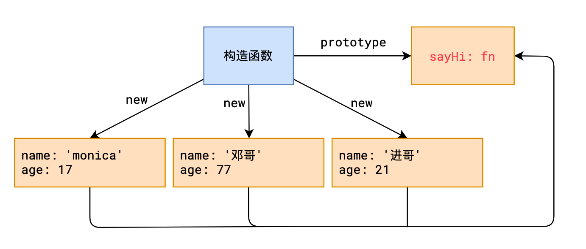
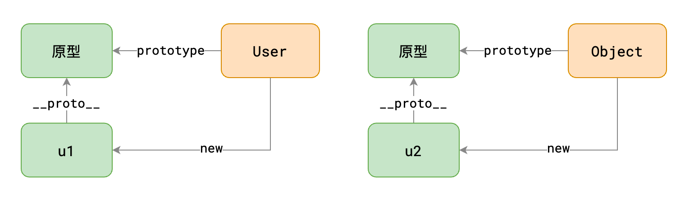
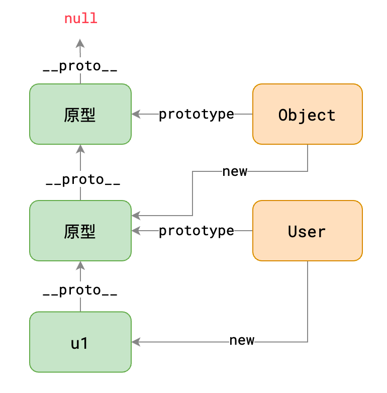
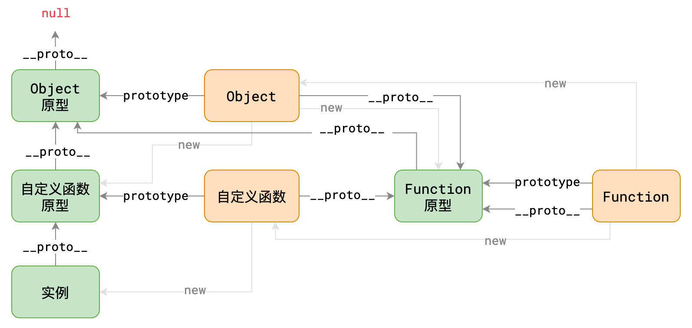

## 原型


1. **原型**

   每个函数都会自动附带一个属性`prototype`，这个属性的值是一个普通对象，称之为原型对象

2. **实例**

   instance，通过`new`产生的对象称之为实例。

   > 由于 JS 中所有对象都是通过`new`产生的，因此，严格来说，JS 中所有对象都称之为实例

3. **隐式原型**

   每个实例都拥有一个特殊的属性`__proto__`，称之为隐式原型，它指向构造函数的原型

这一切有何意义？

**当访问实例成员时，先找自身，如果不存在，会自动从隐式原型中寻找**

**这样一来，我们可以把那些公共成员，放到函数的原型中，即可被所有实例共享**



## this 指向

不同的场景，**这** 指代的含义不同，JS 中的**this**关键字也是如此：

- 在全局代码中使用 this，指代全局对象

  > 在真实的开发中，很少在全局代码使用 this

- **在函数中使用 this，它的指向完全取决于函数是如何被调用的**

  | 调用方式          | 示例                | 函数中的 this 指向 |
  | ----------------- | ------------------- | ------------------ |
  | **通过 new 调用** | `new method()`      | 新对象             |
  | **直接调用**      | `method()`          | 全局对象           |
  | **通过对象调用**  | `obj.method()`      | 前面的对象         |
  | **call**          | `method.call(ctx)`  | call 的第一个参数  |
  | **apply**         | `method.apply(ctx)` | apply 的第一个参数 |
  |                   |                     |                    |

## 原型链

### 什么是原型链

**所有的对象都是通过`new 函数`的方式创建的**

```js
var u1 = new User('邓', '旭明') // 对象 u1 通过 new User 创建
var u2 = {
  // 对象 u2 通过 new Object 创建
  firstName: '莫',
  lastName: '妮卡'
}
// 等效于
var u2 = new Object()
u2.firstName = '莫'
u2.lastName = '妮卡'
```

上面的代码形成的原型图如下


原型对象本身也是一个对象，默认情况下，是通过`new Object`创建的，因此，上面的两幅原型图是可以发生关联的


> `Object.prototype.__proto__`比较特殊，它固定指向 null

可以看出，u1 的隐式原型形成了一个链条，称之为**原型链**

当读取对象成员时，会先看对象自身是否有该成员，如果没有，就依次在其原型链上查找

### 完整的链条



### 对开发的影响

#### 在原型上更改会产生多大影响

更改构造函数的原型会对所有原型链上有该构造函数的原型的对象产生影响

#### 利用原型链判断类型

::: code-group

```js [instanceof关键字【常用】]
// 判断object的原型链中，是否存在constructor的原型
object instanceof constructor
```

```js [Object.getPrototypeOf()【不常用】]
// 返回object的隐式原型
Object.getPrototypeOf(object)
```

:::

#### 创建空原型的对象

::: code-group

```js [Object.create()]
// 返回一个新对象，新对象以target作为隐式原型
Object.create(target)
```

```js [Object.setPrototypeOf()]
// 设置obj的隐式原型为prototype
Object.setPrototypeOf(obj, prototype)
```

:::
